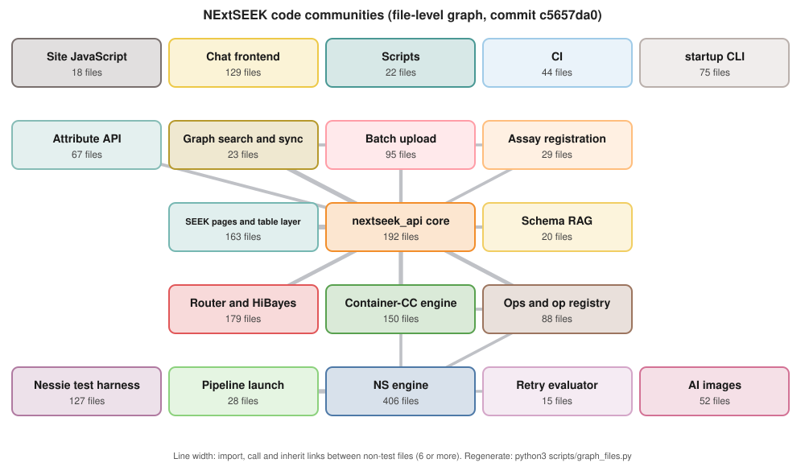

# NExtSEEK architecture

How the pieces fit, on one page. Each part below is a line or two and a link to the doc that owns it;
this page states no detail those docs own. The picture is the file-level code graph
([`docs/graph/README.md`](docs/graph/README.md) says how it is made and refreshed).

Boxes are groups of files that import each other (named after the folder most of them live in); lines are
the heaviest links between non-test files. [`docs/graph/graph.html`](docs/graph/graph.html) shows every file.

## The parts

**Pages.** Server-rendered HTML from `seek/` (views and templates over SEEK's tables, through the legacy table
layer in `seek/` and `dmac/`), styled by the theme in `themes/`. The UI guide is
[`docs/ui/README.md`](docs/ui/README.md); folder detail is in [`seek/README.md`](seek/README.md),
[`dmac/README.md`](dmac/README.md) and [`themes/README.md`](themes/README.md). The site's own user docs are
[`themes/NextSeek/docs/README.md`](themes/NextSeek/docs/README.md).

**API.** `nextseek_api/` is the Django app behind every `/nextseek_api/` URL: native endpoints, SEEK proxy
endpoints, and the assistant's HTTP surface. It is the hub of the graph above. See
[`nextseek_api/README.md`](nextseek_api/README.md).

**Nessie.** All AI code is in `NessieAI/`: the router, the in-process NS engine (`NessieAI/chat_nextseek/`), the
per-turn Container-CC engine (`NessieAI/cc/`), the granular ops and op registry, HiBayes, the chat panel and the AI
images. Start at [`NessieAI/README.md`](NessieAI/README.md); the cross-boundary system map is
[`NessieAI/docs/architecture.md`](NessieAI/docs/architecture.md).

**Ingest pipelines.** Batch upload of sample workbooks, the attribute API and assay registration, each a
subpackage of `nextseek_api/` with its own README:
[`nextseek_api/batch_upload/README.md`](nextseek_api/batch_upload/README.md),
[`nextseek_api/attributes/README.md`](nextseek_api/attributes/README.md),
[`nextseek_api/assay_registration/README.md`](nextseek_api/assay_registration/README.md).

**Graph search and sync.** A Neo4j copy of the sample records that search reads, kept equal to MySQL by one
writer. See "The Neo4j graph" below.

**Catalog context.** The hand-owned sample type, assay and project catalogs that Nessie reads:
[`context/README.md`](context/README.md).

**Storage.** SEEK's MySQL schema (SEEK owns it; NExtSEEK reads it and writes through SEEK or its own writers),
the `dmac` schema (NExtSEEK's own tables, Django models and migrations in `nextseek_api/`), Neo4j (derived from
the two, never a source of truth), and the file store. Topology, volumes and ports: `DEPLOYMENT.md` §0.

**Images and bring-up.** One Compose stack: the app image (Django, its Celery workers and the graph sync
loop), SEEK with its workers and Solr, MySQL, Neo4j, nginx, a message broker, and the AI images
(`NessieAI/docker/`). `./startup.sh` brings it up
([`startup/README.md`](startup/README.md)); deploys follow [`DEPLOYMENT.md`](DEPLOYMENT.md); CI is
[`ci/README.md`](ci/README.md).

## Known debts at the boundaries

Found by the code graph; each is a real import, not a graph artefact.

- Product code imports the test tree. The `nessie` management command
  (`nextseek_api/management/commands/nessie.py`) and `NessieAI/hibayes/human_grade_fit.py` import modules from
  `NessieAI/tests/nessie_tests/`, and the live router reads that folder's `corpus.json` through
  `NessieAI/paths.py`. That is why the app image must carry `NessieAI/tests/`.
- The NS engine package imports the Django app: `NessieAI/chat_nextseek/src/chat_nextseek/orchestrator.py`
  imports `nextseek_api.assistant.excel_export`, so `chat_nextseek` is not the standalone package its
  `pyproject.toml` suggests.
- The Container-CC engine reaches the legacy table layer directly: `NessieAI/cc/cc_provision.py` imports
  `seek.seekdb.SeekDB` instead of going through `nextseek_api/`.

## The Neo4j graph

What the graph holds and every rule its writer enforces: [`docs/neo4j-schema.md`](docs/neo4j-schema.md). How
to query it by hand: [`docs/neo4j-programmatic-access.md`](docs/neo4j-programmatic-access.md). Every place it
lives in the tree:

| Where | What |
|---|---|
| `nextseek_api/graph_sync/` | the one writer: hooks, outbox loop, nightly and weekly syncs, drift check ([README](nextseek_api/graph_sync/README.md)); its tables are `nextseek_api` models (`models_db.py`, migration `nextseek_api/migrations/0021_graph_sync_outbox_and_run.py`); run by `nextseek_api/management/commands/graph_sync.py` and the loop in `docker/scripts/entrypoint.sh` |
| `nextseek_api/graph_search/` | the engine behind `POST /nextseek_api/samples/graph_search/` ([README](nextseek_api/graph_search/README.md)); its ViewSet is `nextseek_api/services/graph_search.py`, and `nextseek_api/services/graph_sync_status.py` reports sync state |
| `nextseek_api/batch_upload/neo4j_sync.py`, `nextseek_api/assay_registration/graph.py` | read MySQL into graph rows; the writes go through graph_sync |
| other readers in `nextseek_api/` and `seek/` | open their own driver: `nextseek_api/views.py`, `nextseek_api/services/` (`entity_tree.py`, `sample_types.py`, `sample_workbook.py`, `sample_retrieve.py`, `sampletype_connections.py`), `nextseek_api/management/commands/derive_sample_type_requirements.py`, `seek/sample/trees.py`, `seek/views/admin.py` |
| NS graph agent | `NessieAI/chat_nextseek/src/chat_nextseek/agents/graph.py` with its prompts (`prompts/graph_agent.txt`, `prompts/graph_schema_structure.txt`) and schema (`schemas/graph.py`) |
| graph scope and Cypher guards | `graph_scope.py` (who may see what), `cypher_scope.py` (inject and prove the project scope), `cypher_text.py`, all in `NessieAI/chat_nextseek/src/chat_nextseek/` |
| live catalog and context | `graph_catalog.py` (reads the live catalog), `graph_context.py` (renders it), `graph_review.py` and `graph_review_counts.py` (check a result), `graph_retry.py` (the zero-row retry), in the same folder |
| Neo4j tool | `NessieAI/chat_nextseek/src/chat_nextseek/helpers/tools/neo4j.py` runs the agent's Cypher |
| committed fallback context | `neo4j_schema.json`, `neo4j_protocol_schema.json`, `neo4j_assay-sample-conn.json` and the parser's `min_graph_schema.json` in `NessieAI/chat_nextseek/src/chat_nextseek/context/` ([context table](context/README.md)) |
| CC graph ops | `NessieAI/ns/granular.py` (the in-app `graph` and `graph-schema` ops) behind the agent's `nextseek-graph` and `nextseek-graph-schema` commands in `NessieAI/docker/cc-runtime/build_context/plugins/nextseek/bin/` |
| scripts | `scripts/graph_schema_fallback.py` (regenerates the fallback files), `scripts/graph_schema_from_apoc.py` (APOC prototype), `scripts/graph_search/` (benchmark and parity lane, [README](scripts/graph_search/README.md)), `scripts/sample_retrieve_parity.py` |
| bring-up | `startup/steps/seed.py` loads `startup/seed/neo4j.cypher.gz` (made by `startup/seed/regenerate/dump_neo4j.py`); `startup/steps/validate.py` runs the graph drift check |
| tests and CI | `nextseek_api/tests/` (graph_sync and graph_search, blocking in `ci-pytest.yml`), `NessieAI/tests/chat_nextseek/` and its `graph_scope/` folder, `NessieAI/tests/ns/`, `startup/tests/test_validate_graph_drift.py`, and the post-deploy smoke tests `ci/smoke/test_graph_search.py`, `ci/smoke/test_graph_sync_status.py`, `ci/smoke/test_graph_behaviour.py` ([ci/README.md](ci/README.md)) |
| other docs | the project graphs on the site: [`docs/ui/projects-catalogs-graphs.md`](docs/ui/projects-catalogs-graphs.md); the user page: [`themes/NextSeek/docs/graph-search.md`](themes/NextSeek/docs/graph-search.md); optional Browser access: `docker/nginx-optional/neo4j.conf.example` |
