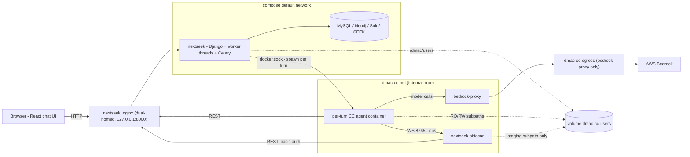
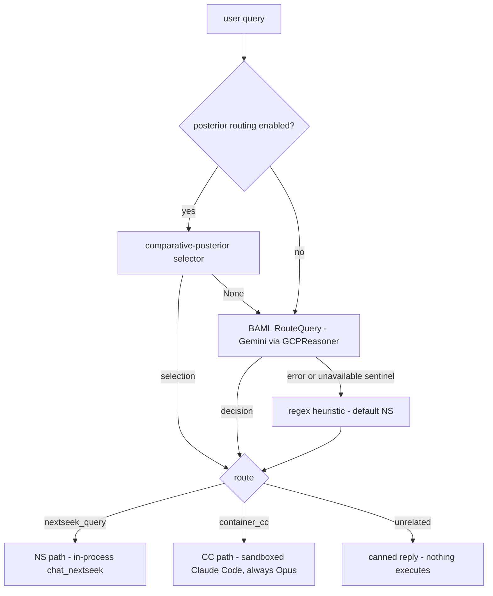
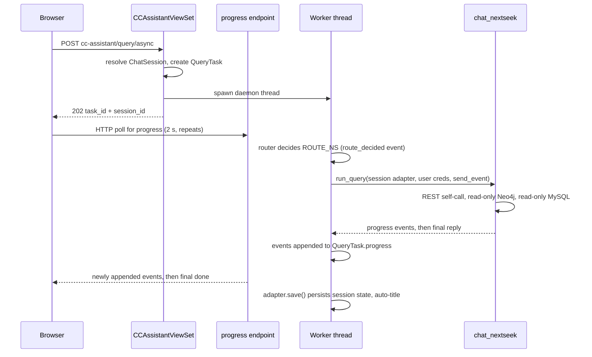
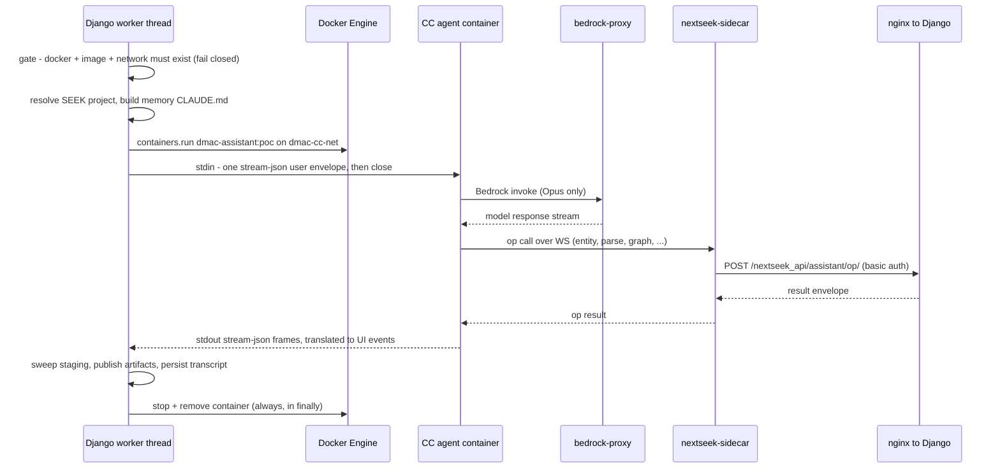

# Nessie architecture

**Nessie** is the chat assistant embedded in NExtSEEK: a chat page inside the NExtSEEK web app, a query router, and two execution paths: an in-process pipeline ("NS") built on NExtSEEK's assistant engine `chat_nextseek`, and a per-turn sandboxed Claude Code container ("CC"). This document also covers the deployment and security topology those paths need.

> **Provenance.** Refreshed against the worktree on branch `docs/repo-wide-refresh` at `ad226f1`, 2026-09-03, by direct code inspection, then repointed to the `NessieAI/` layout with the NessieAI move (paths changed; each line anchor was carried to the same source line in its moved file). All file paths are relative to the repository root. Where a runtime value depends on a deployment env file that is not committed, the code default is stated. This document is the **system map across boundaries**; each folder has its own `README.md` (and a `CLAUDE.md` where it has invariants), which is the authority for that folder's internals. Where this file and a folder's docs disagree, the folder's docs win. Start at `NessieAI/README.md`; see the [Directory map](#directory-map) for the rest.

> **Naming decoder.** Identifiers beginning with `dmac-`/`dmac_` (the agent image `dmac-assistant:poc`, the networks `dmac-cc-net` and `dmac-cc-egress`, the volume `dmac-cc-users`, the `NessieAI/dmac_assistant/` Python package) all name parts of NExtSEEK's Container-CC assistant subsystem: `NessieAI/router/` picks the route, `NessieAI/cc/` is the CC engine, the `CCAssistantViewSet` in `nextseek_api/services/cc_assistant.py` and the Django shell in `nextseek_api/cc_assistant/` are its application layer, `NessieAI/dmac_assistant/` is its (vendored) router package, and `NessieAI/docker/cc-runtime`, `NessieAI/docker/ns-sidecar`, `NessieAI/docker/bedrock-proxy` are its runtime images. It is all NExtSEEK code.

---

## TL;DR

- The chat UI lives at **`/seek/assistant/`** inside NExtSEEK (login is SEEK-credential based). The route is declared at `seek/urls.py:13` and mounted under `^seek/` by `dmac/urls.py:27`; `USE_I18N = False` (`dmac/settings.py:56`) so `i18n_patterns` adds no language prefix. A React app posts each message to a Django endpoint and reads progress by **HTTP-polling** a task endpoint; a WebSocket progress channel exists but needs the ASGI server (`docker/scripts/entrypoint.sh:61-65`).
- Every message goes through a **router** (`NessieAI/router/router.py:313`) that picks one of three routes (**NS**, **CC**, or **Unrelated**, a canned reply where nothing executes), declared at `NessieAI/router/router.py:31-33`. There are now **three** route-choosing strategies, not two: a feature-flagged comparative-posterior selector, a BAML/Gemini router, and a regex heuristic.
- **NS path**: NExtSEEK's assistant engine `NessieAI/chat_nextseek/` runs *in-process* in a Django worker thread, using REST self-calls back into NExtSEEK's API, read-only Neo4j queries, and read-only MySQL reads.
- **CC path**: one **ephemeral Docker container per turn** (image `dmac-assistant:poc`) runs Claude Code in auto-permission mode on an **internal, gateway-less network** (`dmac-cc-net`, `docker-compose.yml`). The agent holds **zero AWS credentials**: model calls go through a credential-holding `bedrock-proxy` that only allows one Opus model (`NessieAI/docker/bedrock-proxy/app/config.py:18`). Per-turn caps: spend budget **$0.50** (`NessieAI/cc/cc_engine.py:73`), 50 turns (`NessieAI/cc/cc_engine.py:74`), and a wall-clock ceiling defaulting to 180 s (`NessieAI/cc/cc_engine.py:81`).
- The CC agent's NExtSEEK "ops" are **chat_nextseek functions exposed as standalone server-side operations**: the agent container ships only thin shims; the intelligence executes inside Django.

---

## System topology

**Legend.** Solid arrows are request flows; dotted lines are volume mounts. `nextseek_nginx` is the **only service on both the default network and `dmac-cc-net`** (`docker-compose.yml:75-77`) and is the sandboxed agent's only route back into NExtSEEK. `dmac-cc-net` is declared `internal: true` (`docker-compose.yml`), so it has no NAT/gateway at all; `bedrock-proxy` is the only service that also joins the egress-capable `dmac-cc-egress` (`docker-compose.yml:102-103`, `docker-compose.yml`), which is how AWS stays reachable while the agent inherits no internet path. The Django container sits on the default network only, so the agent has no L3 reach to Django, MySQL, SEEK, Solr, or Neo4j. `bedrock-proxy` and `nextseek-sidecar` publish no host port. The per-turn agent container is spawned by Django via the bind-mounted Docker socket (`docker-compose.yml:44`, docker-py), not by compose.

---

## Anatomy of a turn

### 1. Front door: page, auth, submit, progress

**Page.** `seek/urls.py:13` maps `^assistant/` to `views.smartSearch`, whose definition is at **`seek/views/search.py:110`**: `seek/views.py` no longer exists; the views are a package of 11 modules whose re-exports are listed at `seek/views/__init__.py:11-20`. Unauthenticated users get an error page (`seek/views/search.py:111-113`); authenticated users get `seek/templates/smartSearch.html` (`seek/views/search.py:114`), which mounts `
` (`seek/templates/smartSearch.html:7`), sets `<meta name="chat-basename" content="/seek/assistant/">` (`seek/templates/smartSearch.html:4`), and loads the embedded React build via `` (`seek/templates/smartSearch.html:8`).

**Auth.** The Django session comes from SEEK-credential login (`dmac/views.py:110` `login_seek`): credentials are checked via `SeekDB.getSeekLogin`, stored in the session, then Django `authenticate()` + `login()` run; the bare GET renders `login.html` (`dmac/views.py:168`). Login is SEEK, not MIT SSO. The embedded frontend is same-origin cookie-based: `NessieAI/chat_frontend/src/lib/services/sessionAuth.ts:14` derives the API base from `window.location`, `NessieAI/chat_frontend/src/lib/services/sessionAuth.ts:19` derives the `ws://`/`wss://` base the same way, and `NessieAI/chat_frontend/src/lib/services/sessionAuth.ts:4-11` sends `X-CSRFToken` only if a `csrftoken` cookie exists.

**Submit.** `NessieAI/chat_frontend/src/lib/services/chatApi.ts:78` POSTs to **`/nextseek_api/cc-assistant/query/async/`**. `use_prod` selects the alternate `NEXTSEEK_CHAT_CONFIG_PROD` ChatConfig and swaps the pipeline's outbound API credentials for that config's baked-in `API_USER`/`API_PASS` (`NessieAI/cc/turn.py:285-288`); the requesting user's own credentials are captured before the swap (`NessieAI/cc/turn.py:280`) and are what the CC route carries.

**Server dispatch.** Both viewsets are DRF-router-registered under `/nextseek_api/`: `assistant/` → `AssistantViewSet` (`nextseek_api/urls.py:38`), `cc-assistant/` → `CCAssistantViewSet` (`nextseek_api/urls.py:40`). They are additive: the new one does not replace the old. `CCAssistantViewSet.query_async` (`nextseek_api/services/cc_assistant.py:164`) validates the request and calls `_start_task(force_cc=False)`; a second endpoint `cc/query/async/` (`nextseek_api/services/cc_assistant.py:186`) forces the CC route. Auth: DRF Token, CSRF-exempt session, and Basic (`nextseek_api/services/cc_assistant.py:89`).

`_start_task` (`nextseek_api/services/cc_assistant.py:119`):

1. Resolves the `ChatSession`: a miss returns 404 (`nextseek_api/services/cc_assistant.py:120-125`).
2. Creates a `QueryTask` (status `running`) (`nextseek_api/services/cc_assistant.py:127-129`) and builds `send_event = make_db_event_callback(...)` (`nextseek_api/services/cc_assistant.py:131`; `nextseek_api/assistant/pipeline_adapter.py:10-16`): every progress event is *appended to the `QueryTask.progress` JSON column*, and terminal events also set `status`/`result` (`nextseek_api/assistant/pipeline_adapter.py:30-44`).
3. Wraps the `ChatSession` in a `DictSessionAdapter` (`nextseek_api/services/cc_assistant.py:132`; `nextseek_api/assistant/session_adapter.py:17-32`), resolves the user's SEEK credentials, and hands all of it to `start_task` (`NessieAI/cc/turn.py:266`), which spawns a **plain daemon thread** (`NessieAI/cc/turn.py:546`). This is *not* Celery: Celery (`batch_upload` queue) serves the file-upload endpoint (`docker/scripts/entrypoint.sh:67-70`).
4. Returns **HTTP 202 `{task_id, session_id}`** immediately.

**Progress transport: HTTP polling in practice.** The client first *attempts* a WebSocket at `ws/assistant/progress/{task_id}/` (`NessieAI/chat_frontend/src/lib/services/chatApi.ts:110`) and, if it fails to open, falls back to HTTP polling at a 2 s interval (`NessieAI/chat_frontend/src/lib/services/chatApi.ts:12`) of `/nextseek_api/assistant/tasks/{taskId}/progress/` (`NessieAI/chat_frontend/src/lib/services/chatApi.ts:181`; note the *assistant* endpoint, not cc-assistant). A socket that opens and then drops before the turn's final event hands over to the same poll, which resumes after the events the socket already delivered, so the answer still arrives and nothing is shown twice. Which channel actually runs is decided by the web-server toggle in `docker/scripts/entrypoint.sh:61-65`: `NEXTSEEK_SERVER=gunicorn` (WSGI) cannot complete a WS handshake; anything else starts `daphne` (ASGI), which is the code default. <!-- UNVERIFIED: which server the dev and production instances actually run is a deployment-time env value; the previously recorded "gunicorn on the running instance" observation is from 2026-07-12 and was not re-checked for this refresh. -->

Under daphne, the WS leg is served by `TaskProgressConsumer` (`nextseek_api/assistant/consumers.py:18`), mounted as the single WS route by `nextseek_api/assistant/routing.py:7-11` and wired into channels' auth stack at `dmac/asgi.py:23` and `dmac/asgi.py:25-29`. There is no channel-layer broadcast: it polls the `QueryTask` row every 300 ms (`nextseek_api/assistant/consumers.py:44`), streams newly appended events, then sends a final `{event: 'done', status, result}` frame and closes (`nextseek_api/assistant/consumers.py:136-158`). **The task UUID is explicitly *not* a capability token**: a connection carrying a valid UUID but no authenticated user is rejected, and the user comes from the Django session cookie via `AuthMiddlewareStack` (`nextseek_api/assistant/consumers.py:29-41`). Separately, a **legacy synchronous SSE endpoint** survives: `POST /nextseek_api/assistant/query/` runs the NS pipeline and streams progress as `text/event-stream` (`nextseek_api/services/assistant.py:580`; the pipeline body is `run_sse_pipeline` at `NessieAI/ns/turn.py:166`, the stream `nextseek_api/services/assistant.py:660-666`); SSE works fine under WSGI, but the embedded UI never calls it.

**Session management** (list / rename / delete / hydrate turns) uses the pre-existing `AssistantViewSet` routes: `GET|PATCH|DELETE /nextseek_api/assistant/sessions/...` (`NessieAI/chat_frontend/src/lib/services/chatApi.ts:322`, `NessieAI/chat_frontend/src/lib/services/chatApi.ts:334`, `NessieAI/chat_frontend/src/lib/services/chatApi.ts:353`, `NessieAI/chat_frontend/src/lib/services/chatApi.ts:367`).

### 2. The router

`cc_router.decide(query)` (`NessieAI/router/router.py:313`) chooses between **three** strategies, not two:

- **Posterior leg**: `decide` consults `posterior_selector.posterior_routing_enabled()` first (`NessieAI/router/router.py:315`), a Django-settings feature flag defaulting to off (`NessieAI/router/posterior_selector.py:45-46`). When on, `_posterior_enabled_decide` (`NessieAI/router/router.py:245`) calls `select_route` (`NessieAI/router/posterior_selector.py:56`); a returned selection short-circuits the BAML leg entirely, and `None` falls through to it. When the flag is off, `_legacy_decide` (`NessieAI/router/router.py:238`) is the whole path.
- **LLM leg**: `_route_query` (`NessieAI/router/router.py:217`) runs the BAML function `RouteQuery` through a guarded, function-body import of `dmac_assistant.router.agent.RouterAgent` (`NessieAI/router/router.py:140-144`), bound to client `GCPReasoner`, provider `google-ai`, model `gemini-3.1-pro-preview`, key `GCP_API_KEY`, exponential retry with `max_retries 2` (`NessieAI/dmac_assistant/baml_src/clients.baml:5-22`). Any error yields `None` → heuristic. If the router package's own error fallback fires (sentinel reasoning `<router_unavailable>`, `NessieAI/router/router.py:34`), the sentinel is detected and the heuristic runs instead, so an unavailable LLM never silently forces the expensive CC route.
- **Heuristic leg**: a regex keyword classifier (`NessieAI/router/router.py:112`) defaulting to `ROUTE_NS` (`NessieAI/router/router.py:44-49` are the two pattern sets).
- **Model pinning**: for the CC route, `model_class` is always `'opus'` and `model_id` always comes from `resolve_cc_model()` (`NessieAI/dmac_assistant/src/dmac_assistant/router/models.py:104-112`), which returns the fixed `opus` entry of `NessieAI/dmac_assistant/build_context/router_model_class_map.json:2` → `us.anthropic.claude-opus-4-8`. Sonnet/haiku entries exist in that map but are never selected: only Opus is allowlisted by the bedrock-proxy (`NessieAI/docker/bedrock-proxy/app/config.py:18`), so anything else would be refused.
- **Unrelated**: emits one `query_complete` with a fixed "NExtSEEK research assistant for the MIT BioMicro Center … outside that scope" reply (`NessieAI/router/router.py:36-41`); neither path runs.
- **Forced CC**: the `cc/query/async/` endpoint bypasses the router entirely (`nextseek_api/services/cc_assistant.py:194`).

### 3. NS path: the in-process engine

On `ROUTE_NS`, the worker thread calls `chat_nextseek.orchestrator.run_query` (or `run_query_plan` when `mode == 'plan'`) directly, passing the `DictSessionAdapter` and the user's own SEEK credentials.

Key mechanics:

- **Config isolation**: the orchestrator `copy.copy()`s the shared config and sets `API_USER`/`API_PASS` on the copy, so the shared `ChatConfig` singleton is never mutated across concurrent requests (`NessieAI/chat_nextseek/src/chat_nextseek/orchestrator.py:201-203`).
- **Session state**: `DictSessionAdapter` (`nextseek_api/assistant/session_adapter.py:17-32`) presents the Django `ChatSession` as a dict-like session. `results_history` and `last_debug` have dedicated columns; everything else the engine writes round-trips through the `extra_state` JSON column (`nextseek_api/assistant/models_db.py:16`). `save()` takes a row lock and merges bundle history by id (`nextseek_api/assistant/session_adapter.py:89-118`).
- **Data access tools**:
  - *NExtSEEK REST self-call*: `tool_nextseek_api_request` (`NessieAI/chat_nextseek/src/chat_nextseek/helpers/tools/nextseek_api.py:83`) with HTTP Basic auth as the user and a 90 s timeout (`NessieAI/chat_nextseek/src/chat_nextseek/helpers/tools/nextseek_api.py:133`) raised to 120 s for advanced search (`NessieAI/chat_nextseek/src/chat_nextseek/helpers/tools/nextseek_api.py:135`). Its base URL prefers `NEXTSEEK_INTERNAL_BASE_URL` over the public one, since self-calls run inside the container where a host-published port would be unreachable (`NessieAI/chat_nextseek/src/chat_nextseek/config.py:27`).
  - *Neo4j*: `tool_neo4j_query` (`NessieAI/chat_nextseek/src/chat_nextseek/helpers/tools/neo4j.py:57`) is **read-only by construction**: a regex blocks `CREATE|MERGE|SET|DELETE|DETACH DELETE|REMOVE|DROP|CALL db.|CALL apoc.schema.|CALL apoc.periodic.|LOAD CSV` (`NessieAI/chat_nextseek/src/chat_nextseek/helpers/tools/neo4j.py:73`).
  - *MySQL*: the reporter's project-sample report path reads directly via `config._connect_db(...)`, issuing hand-built read-only `SELECT`s. <!-- UNVERIFIED: no regex or gate on this path was located; asserting the absence would need an exhaustive search of the reporter tree that this refresh did not run. -->

### 4. CC path: one sandboxed container per turn

On `ROUTE_CC`, the same worker thread hands off to `NessieAI/cc/cc_engine.py`; `run_cc_turn` is the driver. One ephemeral container is spawned per turn, runs the `claude` CLI directly, and is always removed afterwards. The image's own `CMD` (`NessieAI/docker/cc-runtime/Dockerfile:147`) is overridden by the bridge's full command at spawn time.

Step by step:

1. **Gate**: `cc_runner_available()` (`NessieAI/cc/cc_engine.py:179`) requires a live Docker daemon, the agent image (`NessieAI/cc/cc_engine.py:188-191`), *and* the `dmac-cc-net` network (`NessieAI/cc/cc_engine.py:199-202`) to already exist; the bridge never creates the network, so a missing piece fails closed.
2. **Project resolution**: `resolve_user_project` (`NessieAI/cc/cc_provision.py:156`) uses the *user's own* SEEK credentials, via a lazily-imported `SeekDB` (`NessieAI/cc/cc_provision.py:150-151`); any failure rejects the turn rather than guessing.
3. **Cross-session memory**: the most-recently-changed sibling session's transcript is re-summarized (`NessieAI/cc/cc_summary.py:278` → BAML `Summarize` at `NessieAI/cc/cc_summary.py:275`, on client `GCPFlash`, `gemini-3.5-flash` via `GCP_API_KEY`, `NessieAI/dmac_assistant/baml_src/clients.baml:26-32`), then `render_memory` (`NessieAI/cc/cc_memory.py:49`) renders a merged `CLAUDE.md` + transcript-pointer block into the memory mount.
4. **Validation first**: `user_id`, `run_id`, `project_dirname` and the cc-state key are charset/traversal-validated *before* any path interpolation, mkdir or mount; the precondition is stated at `NessieAI/cc/cc_engine.py:951-953`.
5. **Mounts**: all CC user trees are subpaths of the **single external named volume `dmac-cc-users`** (`docker-compose.yml`), never a host bind (`docker-compose.yml:45-53`). `_build_volumes` (`NessieAI/cc/cc_engine.py:932`) builds five: `input` RO → `/data/input` and project-wide `shared` RO → `/data/shared` (`NessieAI/cc/cc_engine.py:960-961`), a **per-turn** scratch subtree RW → `/data/scratch` (`NessieAI/cc/cc_engine.py:971-973`; the user-scoped scratch root is deliberately *not* mounted, `NessieAI/cc/cc_engine.py:962-970`), per-session cc-state RW → `/home/user/.claude` (`NessieAI/cc/cc_engine.py:975-978`), and memory transcripts RO (`NessieAI/cc/cc_engine.py:979-983`). A preflight fails closed if any backing dir is missing (`NessieAI/cc/cc_engine.py:988-991`).
6. **Environment**: `build_agent_environment` (`NessieAI/cc/cc_engine.py:282`) is the single source of the agent env and injects **zero AWS or backend credentials**: Bedrock is pointed at `http://bedrock-proxy:8080` (`NessieAI/cc/cc_engine.py:66`) with the proxy holding the token, and the only secrets are the *requesting user's own* NExtSEEK login. The NExtSEEK base URL is rewritten to the `nextseek_nginx` service host (`NessieAI/cc/cc_engine.py:249`, rationale at `NessieAI/cc/cc_engine.py:247` and `NessieAI/cc/cc_engine.py:268`) because the sibling container cannot reach Django's loopback.
7. **Command**: `claude --print --input-format stream-json --output-format stream-json --verbose --permission-mode auto` (`NessieAI/cc/cc_engine.py:140-145`; a classifier gates each tool call, explicitly *not* `--dangerously-skip-permissions`, `NessieAI/cc/cc_engine.py:136-137`), plus `--model <opus id>`, `--max-turns` and `--max-budget-usd` (`NessieAI/cc/cc_engine.py:759-762`; a budget of 0 omits the flag), a settings-file allowlist of trusted-infra *descriptors*, never secret values (`NessieAI/cc/cc_engine.py:766-772`), and `--resume` when continuing a prior CC session.
8. **Caps**: budget default **$0.50** (`NessieAI/cc/cc_engine.py:73`), turns default **50** (`NessieAI/cc/cc_engine.py:74`), and a wall clock clamped into `[_TIMEOUT_FLOOR, _TIMEOUT_HARD_MAX]` by `clamp_turn_timeout` (`NessieAI/cc/cc_engine.py:103-113`). **The 180 s ceiling is no longer immovable**: `_TIMEOUT_HARD_MAX` itself reads `NEXTSEEK_CC_TIMEOUT_HARD_MAX`, defaulting to 180 (`NessieAI/cc/cc_engine.py:81`), and the per-turn value is `min(NEXTSEEK_CC_TIMEOUT_SECONDS, _TIMEOUT_HARD_MAX)` (`NessieAI/cc/cc_engine.py:84-85`). A watchdog thread force-stops and removes the container on overrun (`NessieAI/cc/cc_engine.py:1172-1182`).
9. **Spawn & input**: docker-py `containers.run` on `dmac-cc-net`, detached; a stale same-name container from a crashed run is force-removed and the spawn retried (`NessieAI/cc/cc_engine.py:919`). The user query is written to stdin as **one** stream-json envelope, then stdin closes.
10. **Streaming out**: the container's stdout is demuxed line-by-line (`NessieAI/cc/attach.py:1-9`); `CCStreamTranslator` (`NessieAI/cc/translate.py:62`) maps Claude's stream-json onto the frontend's vocabulary, emitting `agent_started` (`NessieAI/cc/translate.py:132`), `search_started` (`NessieAI/cc/translate.py:165`, `NessieAI/cc/translate.py:174`), `search_complete` (`NessieAI/cc/translate.py:175`, `NessieAI/cc/translate.py:192`), `query_error` (`NessieAI/cc/translate.py:207`) and `query_complete` (`NessieAI/cc/translate.py:215`). There is **no token streaming**: the final answer arrives as one Markdown string in `query_complete.reply` (`NessieAI/cc/translate.py:5-13`).
11. **Staging sweep**: `sweep_user_staging` (`NessieAI/cc/cc_staging.py:253`) moves this turn's `.complete`-marked artifacts out of `_staging/sha256(api_user)/` into the user's own tree. The destination is derived exclusively from the current request's validated identity and the source only from `sha256(api_user)` (`NessieAI/cc/cc_staging.py:275`, hash at `NessieAI/cc/cc_staging.py:113`). The sidecar's compose mount is locked to the `_staging` subpath (`docker-compose.yml:179-183`), so it cannot write into a user tree by construction (`NessieAI/cc/cc_staging.py:22-23`).
12. **Publish**: `_publish_artifacts` (`NessieAI/cc/cc_engine.py:1841`) diffs a before/after snapshot of the scratch mount and copies changed files into the session's output tree.
13. **Persist**: the newest cc-state `.jsonl` transcript is parsed into a `CCTrace` (`NessieAI/cc/cc_trace.py:32`) and the raw transcript stored zstd-compressed as a `CCSessionTranscript` row (`NessieAI/cc/cc_transcript_store.py:3-4`). `settings.CC_PERSIST_STRICT` controls whether persistence failures raise or log-and-continue (`NessieAI/cc/cc_engine.py:1314`).
14. **Teardown**: a `finally` block always attempts `container.stop(timeout=5)` then `container.remove(force=True)` (`NessieAI/cc/cc_engine.py:1372`, `NessieAI/cc/cc_engine.py:1376`).

---

## The op catalog: chat_nextseek pieces exposed as standalone ops

The agent image does **not** contain `chat_nextseek`; its dependency manifest is `NessieAI/docker/cc-runtime/pyproject.toml:7-24`. Instead the image ships a `nextseek` plugin with **20 executable `nextseek-*` op shims** in `NessieAI/docker/cc-runtime/build_context/plugins/nextseek/bin/` (counted by listing that directory on 2026-09-03; the same count is the registry's, discovered from disk at `NessieAI/tests/cc/bin_inventory.py:21-22`). The runner behind them dispatches 13 agent labels (`NessieAI/docker/cc-runtime/build_context/plugins/nextseek/bin/_nextseek_runner.py:478-492`). The intelligence behind the sidecar family is the NS pipeline's own agents and tools, running server-side inside Django.

**Family A: sidecar ops** (**9**, up from 7): shim → `_nextseek_runner.py` → `_sidecar_client.call_op` (WebSocket to `nextseek-sidecar:8765`, port at `NessieAI/docker/cc-runtime/build_context/plugins/nextseek/bin/_sidecar_client.py:68`, 16 MiB frame cap at `NessieAI/docker/cc-runtime/build_context/plugins/nextseek/bin/_sidecar_client.py:27`) → the sidecar (`NessieAI/docker/ns-sidecar/app/server.py:1-3`, a stateless forwarder whose models are a vendored copy so the image imports no NExtSEEK package, `NessieAI/docker/ns-sidecar/app/granular_models.py:5-6`) → `POST /nextseek_api/assistant/{op}/` with HTTP Basic auth → `AssistantViewSet._run_granular_op` (`nextseek_api/services/assistant.py:1145`) → `NessieAI/ns/granular.py:44-58`, executed **synchronously in the Django request cycle**. The op set is declared in three places that agree: `NessieAI/docker/cc-runtime/build_context/plugins/nextseek/bin/_ws_contract.py:14-17`, `NessieAI/docker/ns-sidecar/app/contract.py:14-17`, and the handler table at `NessieAI/ns/granular.py:261-271`.

| Op shim | Transport | Server-side handler | Logic executes in | Notes |
|---|---|---|---|---|
| `nextseek-entity-extract` | WS → sidecar → REST | `granular._entity` (`NessieAI/ns/granular.py:61`) | Django (chat_nextseek in-process) | `entity_agent` |
| `nextseek-parse` | WS → sidecar → REST | `granular._parse` (`NessieAI/ns/granular.py:66`) | Django | entity + parser agents |
| `nextseek-graph` | WS → sidecar → REST | `granular._graph` (`NessieAI/ns/granular.py:72`) | Django | entity + parser + graph agents, then **executes** the Cypher and returns `{plan, result}` |
| `nextseek-api-read` | WS → sidecar → REST | `granular._api_read` (`NessieAI/ns/granular.py:97`) | Django | endpoint/method allowlist gate → request builder → REST tool |
| `nextseek-api-write` | WS → sidecar → REST | `granular._api_write` (`NessieAI/ns/granular.py:109`) | Django | `confirmed_write is True` gate → request builder → REST tool |
| `nextseek-report` | WS → sidecar → REST | `granular._report` (`NessieAI/ns/granular.py:125`) | Django | reporter summary; artifacts registered as a downloadable bundle (`nextseek_api/services/assistant.py:1184-1185`) |
| `nextseek-generate-submission` | WS → sidecar → REST | `granular._generate_submission` (`NessieAI/ns/granular.py:136`) | Django | report outputs + report-writer agent |
| `nextseek-run-ls` | WS → sidecar → REST | `granular._run_ls` (`NessieAI/ns/granular.py:192`) | Django | read-only `ls -laR` over SSH under the Luria runs root; reingest input |
| `nextseek-build-upload-xlsx` | WS → sidecar → REST | `granular._build_upload_xlsx` (`NessieAI/ns/granular.py:214`) | Django | renders one 4-sheet upload workbook per sample type; **no NExtSEEK write** |

**Family B: batch-upload ops** (7, dispatched from `NessieAI/docker/cc-runtime/build_context/plugins/nextseek/bin/_batch_upload_runner.py:548-556`): shim → `_batch_upload_runner.py` → `BatchUploadClient` (`_batch_upload_client.py`: httpx, Basic auth from env) calling **plain NExtSEEK DRF REST directly**: no sidecar, no chat_nextseek. One member is the exception: `nextseek-extract-text` makes no server call at all.

| Op shim | Transport | Server-side handler | Logic executes in |
|---|---|---|---|
| `nextseek-project-resolve` | direct REST | plain DRF endpoints | agent shim + Django REST |
| `nextseek-sampletype-attrs` | direct REST | plain DRF endpoints | agent shim + Django REST |
| `nextseek-sample-search` | direct REST | plain DRF endpoints | agent shim + Django REST |
| `nextseek-assay-resolve` | direct REST | plain DRF endpoints | agent shim + Django REST |
| `nextseek-build-payload` | direct REST (schema lookups) | plain DRF endpoints | mostly agent shim |
| `nextseek-validate-upload` | direct REST | `POST /nextseek_api/batch-upload/validate/` | Django: validation only, stops before insert |
| `nextseek-extract-text` | **none: fully local** | none (no server call) | agent container only (MarkItDown + fallbacks) |

**Family C: viewset-direct** (**4**, up from 1): these bypass the sidecar and talk to the assistant ViewSet over HTTP. `nextseek-plan` runs the planner (`NessieAI/docker/cc-runtime/build_context/plugins/nextseek/bin/_nextseek_runner.py:166` → `_run_viewset`, `NessieAI/docker/cc-runtime/build_context/plugins/nextseek/bin/_nextseek_runner.py:130`); `nextseek-pipeline` hands a CC-composed cohort summary to the NS pipeline agent in the live chat session (`NessieAI/docker/cc-runtime/build_context/plugins/nextseek/bin/_nextseek_runner.py:428-442`); `nextseek-query` runs a single deterministic NS turn in the live session and materializes bundle rows to scratch (`NessieAI/docker/cc-runtime/build_context/plugins/nextseek/bin/_nextseek_runner.py:259-266`); `nextseek-recall` fetches a prior NS turn's raw rows by turn id (`NessieAI/docker/cc-runtime/build_context/plugins/nextseek/bin/_nextseek_runner.py:345-351`). All four require `NEXTSEEK_CHAT_SESSION_ID`.

### Write safety: layered gates

1. **Claude Code permission allowlist (L1)**: the plugin's setup script merges an allowlist into the agent's `~/.claude/settings.json` (`NessieAI/docker/cc-runtime/build_context/plugins/nextseek/scripts/setup.sh:15-34`): read-class ops and the batch-upload shims are permitted (api-read only with a `--parser-plan` prefix, `NessieAI/docker/cc-runtime/build_context/plugins/nextseek/scripts/setup.sh:18`), but **`nextseek-api-write` is not listed**, nor are `nextseek-query` or `nextseek-recall`. Invoking any of them trips an auto-mode permission prompt.
2. **Shim-local guards**: `nextseek-api-read` refuses `--confirmed-write` outright (`NessieAI/docker/cc-runtime/build_context/plugins/nextseek/bin/_nextseek_runner.py:173-174`); `nextseek-api-write` raises `WRITE_BLOCKED` unless `--confirmed-write` is present (`NessieAI/docker/cc-runtime/build_context/plugins/nextseek/bin/_nextseek_runner.py:192-193`).
3. **Sidecar gate**: deliberately thin. The endpoint allowlist was retired to NExtSEEK and only the write-confirmation flag is checked locally (`NessieAI/docker/ns-sidecar/app/write_gate.py:1-3`).
4. **Django gate (authoritative)**: `build_gate` (`NessieAI/ns/write_gate.py:78-100`): api-write requires `confirmed_write is True` (`NessieAI/ns/write_gate.py:86`); api-read requires `(endpoint, METHOD)` in `NessieAI/ns/read_safe_endpoints.json` (`NessieAI/ns/write_gate.py:92`); the five read-class ops pass (`NessieAI/ns/write_gate.py:34`); **unknown op labels are default-denied** (`NessieAI/ns/write_gate.py:99-100`). Violations map to `WRITE_BLOCKED` / HTTP 403 (`nextseek_api/services/assistant.py:1175-1176`).

> **Known gap.** The Django gate's `SIDECAR_OPS` still lists only the original seven (`NessieAI/ns/write_gate.py:29-31`), while the handler table now has nine (`NessieAI/ns/granular.py:261-271`). The two newest ops never call the gate they are handed (`NessieAI/ns/granular.py:192`, `NessieAI/ns/granular.py:214` both take `write_gate` and never invoke it), so they neither pass nor trip the default-deny at `NessieAI/ns/write_gate.py:99-100`. Both are read-only or produce a reviewable workbook rather than writing to NExtSEEK, so this is a coverage gap, not an open write path.

Additionally, the CC-runtime `container/entrypoint.sh` maps env credentials and scrubs a settings file (`NessieAI/docker/cc-runtime/container/entrypoint.sh:4-7`), symlinks the image-baked plugin tree into `~/.claude/plugins/local/` where headless Claude Code actually discovers it (`NessieAI/docker/cc-runtime/container/entrypoint.sh:73-74`, `NessieAI/docker/cc-runtime/container/entrypoint.sh:87`), and can hold the container open for per-turn `docker exec` (`NessieAI/docker/cc-runtime/container/entrypoint.sh:128-135`).

---

## Deployment & security

### Compose services (`docker-compose.yml`)

The file declares **10 services**, 2 networks and 9 volumes (`docker-compose.yml`).

| Service | Network(s) | Host port | Role & notes |
|---|---|---|---|
| `nextseek` (`docker-compose.yml:2`) | default only | none | Django + worker threads + Celery. Env from `docker/db.env` + `docker/nextseek.env` (`docker-compose.yml:17-19`). Bind-mounts `/var/run/docker.sock` (`docker-compose.yml:44`) and the volume `dmac-cc-users` at `/dmac/users` (`docker-compose.yml:53`). |
| `nextseek_nginx` (`docker-compose.yml:55`) | default **+** `dmac-cc-net` (`docker-compose.yml:75-77`) | `127.0.0.1:${NEXTSEEK_PORT:-8000}` (`docker-compose.yml:57-58`) | The only dual-homed service; the agent's only route back into NExtSEEK. |
| `bedrock-proxy` (`docker-compose.yml:88`) | `dmac-cc-net` **+** `dmac-cc-egress` (`docker-compose.yml:102-103`) | none (`docker-compose.yml:104-105`) | Credential-holding model relay (container `dmac-bedrock-proxy`, `docker-compose.yml:92`). |
| `nextseek-sidecar` (`docker-compose.yml:164`) | `dmac-cc-net` only (`docker-compose.yml:184-185`) | none | Stateless op forwarder; mounts only the reserved `_staging` subpath (`docker-compose.yml:179-183`). |
| `cc-agent` (`docker-compose.yml:120`) | `network_mode: none` (`docker-compose.yml:128`) | none | **Build-target only** (`image: dmac-assistant:poc` `docker-compose.yml:127`, `command: ["true"]` `docker-compose.yml:129`): real agents are spawned per turn by `cc_engine.py` via docker-py. |

The remaining five: `db` (MySQL 8.0, `127.0.0.1:3306`, `docker-compose.yml:202`/`docker-compose.yml:214-215`), `neo4j` (`127.0.0.1:7474` and `127.0.0.1:7687`, `docker-compose.yml:222`/`docker-compose.yml:260-262`), `seek` (`fairdom/seek:1.15.1`, `127.0.0.1:3000`, `docker-compose.yml:264`/`docker-compose.yml:282-283`), `seek_workers` (`docker-compose.yml:291`), `solr` (`docker-compose.yml:316`). The four background workers that were profile-gated services until 2026-09-02 (the attribute worker, dispatcher and recovery scheduler, and the assay-registration drain) are processes of `nextseek` (`docker/scripts/entrypoint.sh`). All five sit on the default network only. The network `dmac-cc-net` is pinned to that literal name (`docker-compose.yml`) and is `internal: true` (`docker-compose.yml`); `dmac-cc-egress` carries only the proxy (`docker-compose.yml`); the volume `dmac-cc-users` is `external: true` (`docker-compose.yml`) with an instance-prefixed name (`docker-compose.yml`).

### Credential placement

| Component | Holds | Never holds |
|---|---|---|
| CC agent container | the requesting user's own NExtSEEK login, proxy/sidecar URLs, path mappings (`NessieAI/cc/cc_engine.py:282`) | any AWS credential, GCP key, DB password, or other backend secret |
| `bedrock-proxy` | the institutional Bedrock bearer token (`NessieAI/docker/bedrock-proxy/app/proxy.py:1-7`) | user credentials |
| `nextseek` (Django) | `GCP_API_KEY` (router + summarizer LLMs), DB/Neo4j/SEEK secrets, via `docker/nextseek.env` (`docker-compose.yml:19`) | none |
| `nextseek-sidecar` | nothing of its own: builds a per-user HTTP config from credentials carried inside the request frame (`NessieAI/docker/ns-sidecar/app/server.py:1-3`) | ambient credentials |

### The bedrock-proxy (`NessieAI/docker/bedrock-proxy/app/proxy.py`)

A FastAPI relay that **drops any inbound `Authorization` header** (`NessieAI/docker/bedrock-proxy/app/proxy.py:54`) and attaches its own bearer token outbound (`NessieAI/docker/bedrock-proxy/app/proxy.py:272`). It exact-match allowlists only `GET /inference-profiles` (`NessieAI/docker/bedrock-proxy/app/proxy.py:138`) and `POST /model/<id>/invoke` / `invoke-with-response-stream` for each allowed model (`NessieAI/docker/bedrock-proxy/app/proxy.py:141-143`): default exactly `us.anthropic.claude-opus-4-8` (`NessieAI/docker/bedrock-proxy/app/config.py:18`). It rejects `//`, dot-segments and percent-encoded separators on the raw undecoded path (`NessieAI/docker/bedrock-proxy/app/proxy.py:101`), enforces a 10 MiB body cap (`NessieAI/docker/bedrock-proxy/app/config.py:22`), and pins the upstream host from the region at config load, which is what removes the SSRF surface (`NessieAI/docker/bedrock-proxy/app/config.py:52-54`). Its access log structurally cannot emit the token or the body (`NessieAI/docker/bedrock-proxy/app/proxy.py:88`). Timeouts are split: connect 10 s / read 600 s / write 60 s / pool 10 s (`NessieAI/docker/bedrock-proxy/app/config.py:27-30`). `/healthz` is the one route exempt from token injection (`NessieAI/docker/bedrock-proxy/app/proxy.py:155-156`).

### API auth notes

Both assistant viewsets accept Token, session and Basic auth. `CCAssistantViewSet` requires only `IsAuthenticated` (`nextseek_api/services/cc_assistant.py:90`); `AssistantViewSet` (the surface the agent's sidecar ops and the Family-C shims terminate in) additionally enforces `UserInParticipatingProject` (`nextseek_api/services/assistant.py:280`), a cached SEEK-project-membership check defined at `nextseek_api/services/assistant.py:133`. The session class is `CsrfExemptSessionAuthentication` (`nextseek_api/authentication.py:15`, re-exported by `nextseek_api/services/assistant.py`), whose `enforce_csrf` is an unconditional no-op (`nextseek_api/authentication.py:27-28`), and note that its docstring's claim that `CsrfViewMiddleware` is "disabled in this project" is **wrong**: the middleware is enabled at `dmac/settings.py:200`. The skip is per-endpoint, not global. WebSocket access, when served under daphne, requires an authenticated session cookie *and* task ownership; the UUID is not a capability token (`nextseek_api/assistant/consumers.py:29-41`).

### Caps & limits

| Limit | Value | Where |
|---|---|---|
| CC per-turn budget | `NEXTSEEK_CC_MAX_BUDGET_USD`, code default **$0.50** (0 omits the flag) | `NessieAI/cc/cc_engine.py:73`, applied at `NessieAI/cc/cc_engine.py:760-762` |
| CC per-turn agent turns | `NEXTSEEK_CC_MAX_TURNS`, default **50** | `NessieAI/cc/cc_engine.py:74` |
| CC wall clock | `min(NEXTSEEK_CC_TIMEOUT_SECONDS, NEXTSEEK_CC_TIMEOUT_HARD_MAX)`, hard max default **180 s** | `NessieAI/cc/cc_engine.py:81`, `NessieAI/cc/cc_engine.py:84-85`, `NessieAI/cc/cc_engine.py:103-113` |
| WS progress poll (daphne only) | 300 ms DB poll | `nextseek_api/assistant/consumers.py:44` |
| Sidecar WS frame | 16 MiB | `NessieAI/docker/cc-runtime/build_context/plugins/nextseek/bin/_sidecar_client.py:27` |
| Sidecar → Django HTTP | 60 s | `NessieAI/docker/ns-sidecar/app/ns_client.py:27` |
| NS REST tool | 90 s, 120 s for advanced search | `NessieAI/chat_nextseek/src/chat_nextseek/helpers/tools/nextseek_api.py:133`, `NessieAI/chat_nextseek/src/chat_nextseek/helpers/tools/nextseek_api.py:135` |
| Proxy request body | 10 MiB | `NessieAI/docker/bedrock-proxy/app/config.py:22` |
| Upload total size | `BATCH_UPLOAD_MAX_TOTAL_BYTES`, default 200 MiB | `nextseek_api/services/cc_assistant.py:249` |

### Persistence (`nextseek_api/assistant/models_db.py`)

Thirteen model classes live in this module across four `assistant_*` tables and nine `eval_*` tables. The four the chat stack writes on a turn:

| Model | Table | Declared at |
|---|---|---|
| `ChatSession` | `assistant_chat_session` | `nextseek_api/assistant/models_db.py:22` |
| `QueryTask` | `assistant_query_task` | `nextseek_api/assistant/models_db.py:64` |
| `TurnLedger` | `assistant_turn_ledger` | `nextseek_api/assistant/models_db.py:90` |
| `CCSessionTranscript` | `assistant_cc_transcript` | `nextseek_api/assistant/models_db.py:341` |

`CCAssistantViewSet` also exposes ownership-checked endpoints for file upload (`nextseek_api/services/cc_assistant.py:236`), upload status (`nextseek_api/services/cc_assistant.py:283`) and listing (`nextseek_api/services/cc_assistant.py:303`), artifact download (`nextseek_api/services/cc_assistant.py:318`) and transcript streaming (`nextseek_api/services/cc_assistant.py:366`).

### Agent image (`NessieAI/docker/cc-runtime/Dockerfile`)

Pins `@anthropic-ai/claude-code@2.1.163` (≥ 2.1.158 required for auto mode on Bedrock, `NessieAI/docker/cc-runtime/Dockerfile:31-32`), runs as a non-root uid-1001 user (`NessieAI/docker/cc-runtime/Dockerfile:47`, `NessieAI/docker/cc-runtime/Dockerfile:140`), bakes a `CLAUDE.md` at `/app/CLAUDE.md` (`NessieAI/docker/cc-runtime/Dockerfile:72`) symlinked into the agent home (`NessieAI/docker/cc-runtime/Dockerfile:88-89`), and sets `WORKDIR /home/user` (`NessieAI/docker/cc-runtime/Dockerfile:141`) so Claude Code discovers it. `chat_nextseek` is deliberately absent: the image installs only its own dependency manifest (`NessieAI/docker/cc-runtime/pyproject.toml:7-24`) via `uv sync --locked` (`NessieAI/docker/cc-runtime/Dockerfile:105-107`).

---

## Directory map

Each folder below documents itself in a `README.md` (plus a `CLAUDE.md` where it has invariants). Those docs, not this file, are the authority for what is inside each folder. This map exists to say **where a thing lives and which doc to open**, nothing more. The AI folders are mapped in more detail in `NessieAI/README.md`.

| Read | Role in Nessie |
|---|---|
| `NessieAI/README.md` | all AI code, and the "to change X, edit Y" map |
| `NessieAI/chat_nextseek/README.md` | the deterministic NS engine: orchestrator, agents, tools, config |
| `NessieAI/router/README.md` | the route decision, its overrides and the posterior leg |
| `NessieAI/cc/README.md` | the per-turn CC sandbox and its op registry |
| `NessieAI/ns/README.md` | the granular ops and the write gate |
| `NessieAI/dmac_assistant/README.md` | the vendored router package: BAML sources, model-class map |
| `NessieAI/hibayes/README.md` | the HiBayes evaluation pipeline behind posterior routing |
| `NessieAI/schema_rag/README.md` | OpenAPI to per-session DuckDB retrieval |
| `NessieAI/build_tools/README.md` | generators for the committed-but-generated op surfaces |
| `NessieAI/chat_frontend/README.md` | the React chat UI (embedded entry `src/main.embedded.tsx`) |
| `NessieAI/docker/README.md` | the four AI image build contexts |
| `NessieAI/tests/README.md` | every AI test lane; `NessieAI/tests/nessie_tests/README.md` is the router-aware harness |
| `api_app/README.md` | the original REST API app, kept after the surface moved |
| `ci/README.md` | the single route declaration and the gates over it |
| `dmac/README.md` | the Django project package: settings, root URLconf, ASGI, SEEK login |
| `docker/README.md` | nginx config and the app image's entrypoint |
| `nextseek_api/README.md` | the app owning every `/nextseek_api/` URL |
| `nextseek_api/assay_registration/README.md` | batch assay membership registration |
| `nextseek_api/assistant/README.md` | the API half of the assistant: ORM models, wire contract, WS consumer |
| `nextseek_api/attributes/README.md` | the native attribute API |
| `nextseek_api/batch_upload/README.md` | the bulk sample-ingest pipeline |
| `nextseek_api/services/README.md` | the ViewSet and service layer, including both chat viewsets |
| `scripts/README.md` | validators and one-off operational programs, not a package |
| `seek/README.md` | the SEEK-schema mirror app and most server-rendered pages |
| `startup/README.md` | the bring-up CLI and the data bring-up installs |
| `themes/README.md` | the server-rendered chrome (and the dead repo-root `templates/`) |

The Django shell of the CC route (the `cc_assistant` app label, its Celery tasks and the
endpoint ownership guard) stays in `nextseek_api/cc_assistant/`, described in
`NessieAI/cc/README.md`.

Two cross-boundary facts worth carrying here:

- `NessieAI/chat_nextseek/` and `NessieAI/dmac_assistant/` are first-party, in-tree packages installed as **editable** path dependencies (`pyproject.toml:136`, `pyproject.toml:139`, declared as project dependencies at `pyproject.toml:121` and `pyproject.toml:125`), so the running venv imports this repository's source directly rather than a divergent site-packages copy (`pyproject.toml:134-135`).
- `nextseek_api/services/` has **no `__init__.py`** and resolves as a PEP 420 namespace package, which is why a tool that walks it by import can come back empty. (Established by listing the directory on 2026-09-03: no `__init__.py`, while every other package directory under `nextseek_api/` has one. The consequences are written up in `nextseek_api/services/README.md`.)

---

## Glossary

- **Nessie**: the whole assistant (chat UI, router, and the NS and CC execution paths).
- **NS route** (`nextseek_query`): the in-process path, where `chat_nextseek` runs inside a Django worker thread (`NessieAI/router/router.py:31`).
- **CC route** (`container_cc`): the Container-CC path, with one sandboxed Claude Code container per turn, always Opus (`NessieAI/router/router.py:32`).
- **chat_nextseek**: NExtSEEK's assistant engine; powers both the NS route and the server side of the agent's sidecar ops.
- **dmac_assistant**: the vendored router package, with BAML functions (`RouteQuery`, `Summarize`), LLM clients (`NessieAI/dmac_assistant/baml_src/clients.baml:15`, `NessieAI/dmac_assistant/baml_src/clients.baml:26`), model-class map.
- **BAML**: the typed prompt/function layer used to call the routing and summarization LLMs (both Gemini via `GCP_API_KEY`).
- **posterior routing**: the third, feature-flagged route strategy that consults an evaluation posterior before the BAML router (`NessieAI/router/posterior_selector.py:45`).
- **auto mode**: Claude Code `--permission-mode auto` (`NessieAI/cc/cc_engine.py:144`): a classifier gates each tool call; not the same as skipping permissions.
- **stream-json**: Claude Code's line-delimited JSON stdin/stdout protocol; translated to UI events by `NessieAI/cc/translate.py:62`.
- **dmac-cc-net**: the internal, gateway-less Docker network holding the agent, sidecar and bedrock-proxy (`docker-compose.yml`); nginx is its only bridge to NExtSEEK.
- **dmac-cc-egress**: the egress-capable network carrying only `bedrock-proxy`, so AWS stays reachable while the agent does not (`docker-compose.yml`).
- **dmac-cc-users**: the single external named volume holding all per-user/per-project CC trees (`docker-compose.yml`).
- **sidecar** (`nextseek-sidecar`): stateless WS-to-REST forwarder for the agent's nine chat_nextseek-backed ops; can write only to `_staging` (`docker-compose.yml:179-183`).
- **bedrock-proxy**: the only component in the CC subsystem holding an AWS credential; Opus-only, path-allowlisted model relay.
- **staging sweep**: the trusted Django-side move of agent-produced artifacts out of `_staging/sha256(user)/` (`NessieAI/cc/cc_staging.py:253`).
- **cc-state**: the per-session `.claude` directory mounted RW into the agent (`NessieAI/cc/cc_engine.py:975-978`), enabling `--resume` and providing the raw turn transcript.
- **QueryTask**: the DB row that doubles as the progress event log (`nextseek_api/assistant/models_db.py:64`); both the WS consumer and the HTTP polling endpoint read from it.
- **cc_session_id**: Claude's own in-container session UUID, distinct from Nessie's `ChatSession` id.
