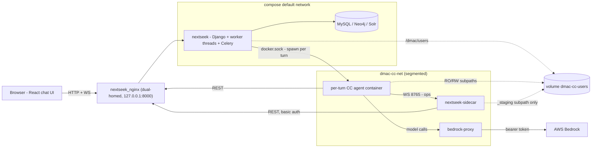
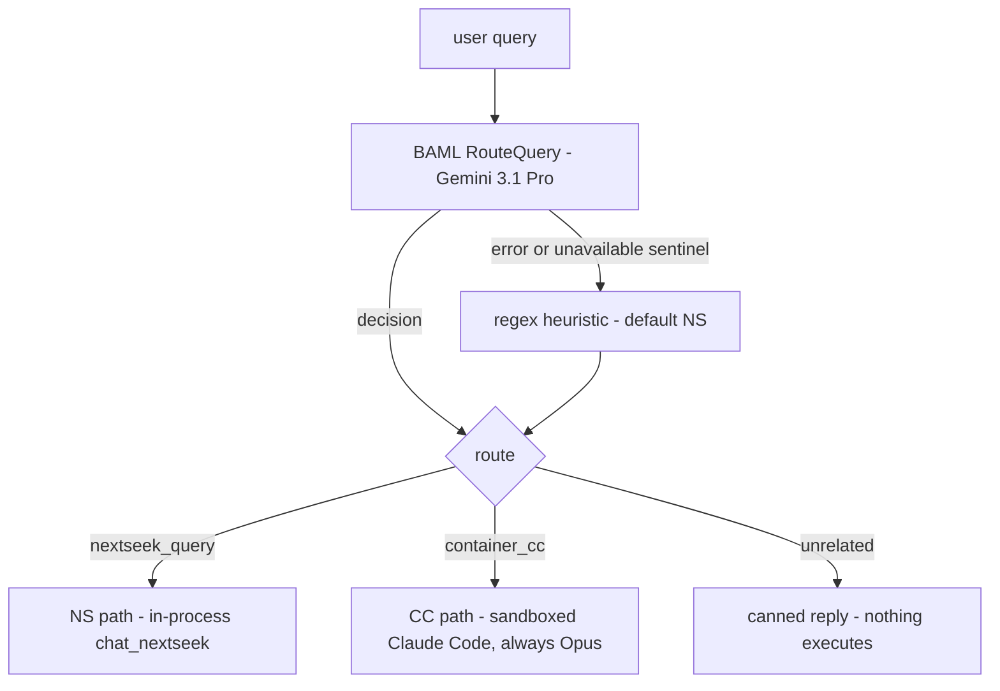
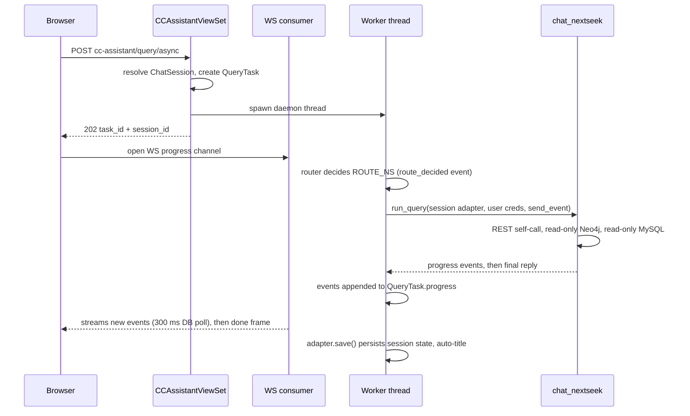
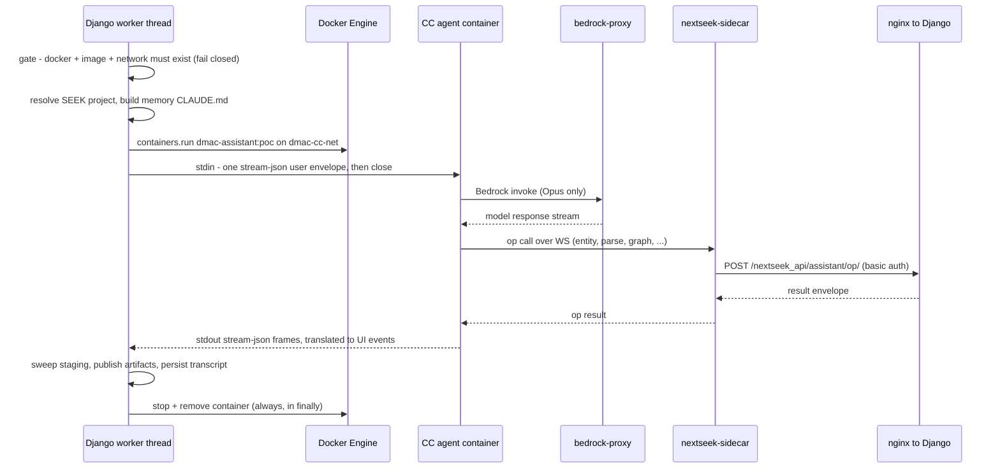

# Nessie — Architecture

**Nessie** is the chat assistant embedded in NExtSEEK: a chat page inside the NExtSEEK web app, a query router, and two execution paths — an in-process pipeline ("NS") built on NExtSEEK's assistant engine `chat_nextseek`, and a per-turn sandboxed Claude Code container ("CC") — plus the deployment and security topology those paths need.

> **Provenance.** Generated from the NExtSEEK codebase on branch `merge/dev-into-feat`, 2026-07-12, by direct code inspection. All file paths are relative to the repository root. Where a runtime value depends on a deployment env file that is not committed, the code default is stated.

> **Naming decoder.** Identifiers beginning with `dmac-`/`dmac_` — the agent image `dmac-assistant:poc`, the network `dmac-cc-net`, the volume `dmac-cc-users`, the `dmac_assistant/` Python package — all name parts of NExtSEEK's Container-CC assistant subsystem: `nextseek_api/cc_assistant/` and the `CCAssistantViewSet` are its application layer, `dmac_assistant/` is its router package, and `docker/cc-runtime`, `docker/ns-sidecar`, `docker/bedrock-proxy` are its runtime images. It is all NExtSEEK code.

---

## TL;DR

- The chat UI lives at **`/seek/assistant/`** inside NExtSEEK (login is SEEK-credential based). A React app posts each message to a Django endpoint and watches progress over a WebSocket (with HTTP-polling fallback).
- Every message goes through a **router** (`nextseek_api/cc_assistant/router.py`): an LLM classifier (Gemini, via BAML) with a regex-heuristic fallback picks one of three routes — **NS**, **CC**, or **Unrelated** (canned reply, nothing executes).
- **NS path**: NExtSEEK's assistant engine `chat_nextseek/` runs *in-process* in a Django worker thread — REST self-calls back into NExtSEEK's API, read-only Neo4j queries, and read-only MySQL reads.
- **CC path**: one **ephemeral Docker container per turn** (image `dmac-assistant:poc`) runs Claude Code in auto-permission mode on a **segmented network** (`dmac-cc-net`). The agent holds **zero AWS credentials** — model calls go through a credential-holding `bedrock-proxy` that only allows one Opus model. Per-turn caps: $2 budget, 50 turns, 180 s hard wall-clock.
- The CC agent's NExtSEEK "ops" are **chat_nextseek functions exposed as standalone server-side operations** — the agent container ships only thin shims; the intelligence executes inside Django.

---

## System topology



**Legend.** Solid arrows are request flows; dotted lines are volume mounts. `nextseek_nginx` is the **only dual-homed service** (member of both networks) and is the sandboxed agent's only route back into NExtSEEK (`docker-compose.yml`). The Django container sits on the default network only, so the agent has no L3 reach to Django, MySQL, SEEK, Solr, or Neo4j. `bedrock-proxy` and `nextseek-sidecar` join *only* `dmac-cc-net` and publish no host port. The per-turn agent container is spawned by Django via the bind-mounted Docker socket (docker-py), not by compose.

---

## Anatomy of a turn

### 1. Front door: page, auth, submit, progress

**Page.** `seek/urls.py` maps `^assistant/` to `views.smartSearch` (`seek/views.py:1554`), mounted under the `^seek/` prefix by `dmac/urls.py`. Unauthenticated users get an error page; authenticated users get `seek/templates/smartSearch.html`, which mounts `<div id="chat-assistant-root">`, sets `<meta name="chat-basename" content="/seek/assistant/">`, and loads the embedded React build via ``.

**Auth.** The Django session comes from SEEK-credential login (`dmac/views.py` `login_seek`): credentials are checked via `SeekDB.getSeekLogin`, stored in the session, then Django `authenticate()` + `login()` run. Login is SEEK, not MIT SSO. The embedded frontend is same-origin cookie-based: `chat_frontend/src/lib/services/sessionAuth.ts` uses relative URLs, derives `ws://`/`wss://` from `window.location`, and sends `X-CSRFToken` only if a `csrftoken` cookie exists.

**Submit.** `chat_frontend/src/lib/services/chatApi.ts` POSTs `{query, mode, use_prod, session_id | force_new}` to **`/nextseek_api/cc-assistant/query/async/`** (`mode` may be a string or `{pipeline: 'standard' | 'plan', useProd}`).

**Server dispatch.** Both viewsets are DRF-router-registered under `/nextseek_api/` (`nextseek_api/urls.py:31-34`): `assistant/` → `AssistantViewSet`, `cc-assistant/` → `CCAssistantViewSet` (additive — the new one does not replace the old). `CCAssistantViewSet.query_async` (`nextseek_api/services/cc_assistant.py`) validates the request and calls `_start_task(force_cc=False)`; a second endpoint `cc/query/async/` forces the CC route. Auth: DRF Token, CSRF-exempt session, and Basic, all requiring an authenticated user.

`_start_task`:

1. Resolves the `ChatSession` — explicit `session_id` (404 unless owned by the user), or a new session if `force_new`, else the user's most-recently-updated session.
2. Creates a `QueryTask` (status `running`), builds `send_event = make_db_event_callback(...)` (`nextseek_api/assistant/pipeline_adapter.py`) — every progress event is *appended to the `QueryTask.progress` JSON column*; terminal events also set `status`/`result`.
3. Wraps the `ChatSession` in a `DictSessionAdapter`, resolves the user's SEEK credentials, and spawns a **plain daemon thread** (`threading.Thread(daemon=True).start()`). This is *not* Celery — Celery (`batch_upload` queue) serves only the file-upload endpoint.
4. Returns **HTTP 202 `{task_id, session_id}`** immediately.

**Progress transport.** The client opens a WebSocket at `ws/assistant/progress/{task_id}/`. Server-side, `TaskProgressConsumer` (`nextseek_api/assistant/consumers.py`) does not use a channel-layer broadcast — it **polls the `QueryTask` row every 300 ms**, streams newly appended events, then sends a final `{event: 'done', status, result}` frame and closes. WS auth: the task UUID acts as a capability token, ownership is enforced when a session cookie authenticates the user, and the `Origin` header is validated. Only if the WS **fails to open** does the client fall back to HTTP polling of `/nextseek_api/assistant/tasks/{taskId}/progress/` (`chatApi.ts:177` — note: the *assistant* endpoint, not cc-assistant).

The ASGI stack (`dmac/asgi.py`) registers exactly one WS route. Whether WS is actually served depends on the web-server toggle in `docker/scripts/entrypoint.sh`: `NEXTSEEK_SERVER=daphne` (ASGI, code default, serves WS) or `gunicorn` (WSGI, no WS — clients use the polling fallback). The deployed value lives in the gitignored `docker/nextseek.env`.

**Session management** (list / rename / delete / hydrate turns) uses the pre-existing `AssistantViewSet` routes: `GET|PATCH|DELETE /nextseek_api/assistant/sessions/...` (`chatApi.ts:308-363`).

### 2. The router

`cc_router.decide(query)` (`nextseek_api/cc_assistant/router.py`) is **BAML-first with a heuristic fallback**:



- **LLM leg**: a guarded import of `dmac_assistant.router.agent.RouterAgent` runs the BAML function `RouteQuery`, bound to client `GCPReasoner` — provider `google-ai`, model `gemini-3.1-pro-preview`, key `GCP_API_KEY`, exponential retry (max 2) (`dmac_assistant/baml_src/clients.baml`). Any import or runtime error yields `None` → heuristic. If the router package's own error fallback fires (sentinel reasoning `<router_unavailable>`, which would default to the CC route), `router.py` detects the sentinel and *also* falls back to its own heuristic — so an unavailable LLM never silently forces the expensive CC route.
- **Heuristic leg**: a regex keyword classifier defaulting to `ROUTE_NS`.
- **Model pinning**: for the CC route, `model_class` is always hardcoded `'opus'` and `model_id` always comes from `resolve_cc_model()` (`dmac_assistant/src/dmac_assistant/router/models.py:104-112`), which returns the fixed `opus` entry of `dmac_assistant/build_context/router_model_class_map.json` → `us.anthropic.claude-opus-4-8`. Sonnet/haiku entries exist in the map but are never selected — only Opus is allowlisted by the bedrock-proxy (anything else would 403).
- **Unrelated**: emits one `query_complete` with a fixed "NExtSEEK research assistant for the MIT BioMicro Center ... outside that scope" reply — neither path runs.
- **Forced CC**: the `cc/query/async/` endpoint bypasses the router entirely (`source='forced'`).
- Every decision — routed or forced — is reported to the client as a `route_decided` event *before* any route-specific work.

### 3. NS path — the in-process engine

On `ROUTE_NS`, the worker thread calls `chat_nextseek.orchestrator.run_query` (or `run_query_plan` when `mode == 'plan'`) directly, passing the `DictSessionAdapter` and the user's own SEEK credentials.



Key mechanics:

- **Config isolation**: the orchestrator `copy.copy()`s the shared config and sets `API_USER`/`API_PASS` on the copy, so the shared `ChatConfig` singleton is never mutated across concurrent requests (`chat_nextseek/src/chat_nextseek/orchestrator.py:338-360`).
- **Session state**: `DictSessionAdapter` (`nextseek_api/assistant/session_adapter.py`) presents the Django `ChatSession` as a dict-like session. `results_history` and `last_debug` have dedicated columns; everything else the engine writes round-trips through the `extra_state` JSON column. `save()` writes all three back.
- **Data access tools**:
  - *NExtSEEK REST self-call* — `tool_nextseek_api_request` (`chat_nextseek/src/chat_nextseek/helpers/tools/nextseek_api.py`) with HTTP Basic auth as the user, 90 s timeout (120 s for advanced search), and HTML sanitization of returned fields. Its base URL prefers `NEXTSEEK_INTERNAL_BASE_URL` (container-internal), since self-calls run inside the container where a host-published port would be unreachable (`chat_nextseek/src/chat_nextseek/config.py:17-30`).
  - *Neo4j* — `tool_neo4j_query` is **read-only by construction**: a regex blocks `CREATE|MERGE|SET|DELETE|REMOVE|DROP|CALL db.|CALL apoc....|LOAD CSV`; a fresh driver is opened and closed per call.
  - *MySQL* — the reporter's project-sample report path reads directly via `config._connect_db(env='dev'|'prod')`, issuing hand-built read-only `SELECT`s (no regex gate on this path).
- **Wrap-up** (NS only): in the `finally` block, `adapter.save()` persists the session and an auto-title is set from the first query.

### 4. CC path — one sandboxed container per turn

On `ROUTE_CC`, the same worker thread hands off to `nextseek_api/cc_assistant/cc_engine.py`. One ephemeral container is spawned per turn, runs the `claude` CLI directly, and is always removed afterwards. (The agent image also contains an unused "idle + exec" runtime mode described in its baked-in docs — the bridge never sets `DMAC_RUNTIME_MODE`, so the docs' description of that mode does not reflect how Nessie runs the agent.)



Step by step (all in `cc_engine.py` / `services/cc_assistant.py` unless noted):

1. **Gate** — `cc_runner_available()` requires a live Docker daemon, the agent image, *and* the `dmac-cc-net` network to already exist; the bridge never creates the network, so a missing piece fails closed with `query_error`.
2. **Project resolution** — `resolve_user_project` uses the *user's own* SEEK credentials via `SeekDB.getCurrentUser`. Empty membership maps to a synthetic `personal-<user>` namespace; any failure rejects the turn (never guessed). If the session's stored project dirname no longer matches, the turn is refused ("SEEK project membership changed").
3. **Cross-session memory** (skipped for `fresh_session`) — metadata is built from the *user's own* sessions only; the most-recently-changed sibling session's transcript is re-summarized (`cc_summary.summarize_transcript` → BAML `Summarize` on `GCPFlash`, `gemini-3.5-flash` via `GCP_API_KEY`; any exception degrades to a deterministic actions-only summary), then `cc_memory` renders a merged `CLAUDE.md` + transcript-pointer block into the memory mount for the agent to read.
4. **Validation first** — `user_id`, `run_id`, `project_dirname`, and the cc-state key are charset/traversal-validated *before* any path interpolation, mkdir, or mount. The container name is deterministic: `dmac-cc-agent-<run_id>`.
5. **Mounts** — all CC user trees are subpaths of the **single external named volume `dmac-cc-users`** (never a host bind). Layout from `cc_provision.build_user_dirs`: per user and project, `input` (RO → `/data/input`), project-wide `shared` (RO → `/data/shared`), `scratch` (RW → `/data/scratch`), per-session `cc-state` (RW → `/home/user/.claude`), and memory `transcripts` (RO → `/home/user/.cc-memory/transcripts`). Django pre-creates each backing dir and a preflight fails closed if any is missing.
6. **Environment** — `build_agent_environment` is the single source of the agent env and injects **zero AWS or backend credentials**: Bedrock is pointed at `http://bedrock-proxy:8080` with auth skipped (the proxy holds the token), auto mode is enabled, and the only secrets are the *requesting user's own* NExtSEEK login (`NEXTSEEK_USERNAME`/`API_USER` etc.). The NExtSEEK base URL is loopback-rewritten to `nextseek_nginx` because the sibling container cannot reach Django's loopback.
7. **Command** — `claude --print --input-format stream-json --output-format stream-json --verbose --permission-mode auto` (a classifier gates each tool call — explicitly *not* `--dangerously-skip-permissions`), plus `--model <opus id>`, `--max-turns` (default 50), `--max-budget-usd` (code default 2.00, 0 disables), a settings-file allowlist of trusted-infra *descriptors* (never secret values), and `--resume <session_id>` when continuing a prior CC session.
8. **Caps** — per-turn budget and turn limits as above, and a wall-clock timeout of `min(NEXTSEEK_CC_TIMEOUT_SECONDS, 180)` — **180 s is a hard cap that cannot be raised**; a watchdog thread force-stops and removes the container on overrun (`query_error` reason `exec_timeout`).
9. **Spawn & input** — docker-py `containers.run` on `dmac-cc-net`, detached, no TTY; a stale same-name container from a crashed run is force-removed and the spawn retried once. The user query is written to stdin as **one** stream-json envelope, then stdin closes.
10. **Streaming out** — the container's stdout is demuxed line-by-line; `CCStreamTranslator` (`nextseek_api/cc_assistant/translate.py`) maps Claude's stream-json to the frontend vocabulary — it emits `agent_started`, `search_started`, `search_complete`, `query_complete`, `query_error`. Non-terminal frames forward immediately; terminal frames are deferred until after artifact publishing. There is **no token streaming** — the final answer arrives as one Markdown reply (with `total_cost_usd`, `num_turns`, `duration_ms`). Claude's in-container session UUID is surfaced as `cc_session_id`, kept distinct from Nessie's `session_id`.
11. **Staging sweep** — after the read loop, `cc_staging.sweep_user_staging` moves this turn's `.complete`-marked artifacts from `_staging/sha256(api_user)/` into the user's own `scratch/nextseek-artifacts/`. The sweep (running in trusted Django) is the **only writer of `{project}/{user}/` paths** in the staging flow; the destination is derived exclusively from the current request's validated identity — never from staged file names — and the walk is symlink-safe. A sweep failure never kills the turn. The sidecar's staging hash is byte-identical to the sweep's, and the sidecar's compose mount is locked to the `_staging` subpath, so it can never write into a user tree.
12. **Publish** — `_publish_artifacts` diffs a before/after snapshot of the scratch mount, copies changed files into `output/artifacts/<turn_id>/` (and `raw/`-prefixed files into `output/raw/`), and augments the terminal event with `mode='cc'`, `artifacts`, `cc_raw_files`.
13. **Persist** — the newest cc-state `.jsonl` transcript is copied to `output/raw/transcript-<run_id>.jsonl` and parsed into a `CCTrace` (`cc_trace.py`); the turn is applied to the session's `extra_state` (chat log + capped trace mirror) and the raw transcript stored zstd-compressed as a `CCSessionTranscript` row. `settings.CC_PERSIST_STRICT` controls whether persistence failures raise or log-and-continue.
14. **Teardown** — a `finally` block always attempts `container.stop(timeout=5)` then `container.remove(force=True)`, on every path: success, timeout, docker error, or exception.

---

## The op catalog — chat_nextseek pieces exposed as standalone ops

The agent image does **not** contain `chat_nextseek` (`docker/cc-runtime/Dockerfile` installs only the bridge deps — websockets/httpx). Instead, the image ships a `nextseek` plugin with **15 op shims** in `docker/cc-runtime/build_context/plugins/nextseek/bin/`, in three families. The intelligence behind the sidecar family is exactly the NS pipeline's own agents and tools, running server-side inside Django.

**Family A — sidecar ops** (7): shim → `_nextseek_runner.py` → `_sidecar_client.call_op` (WebSocket to `nextseek-sidecar:8765`, 16 MiB frame cap, per-request user login) → the sidecar (`docker/ns-sidecar/app/ops.py` — a stateless forwarder with no `chat_nextseek` import) → `POST /nextseek_api/assistant/{op}/` with HTTP Basic auth → `AssistantViewSet._run_granular_op` (`nextseek_api/services/assistant.py:1177`) → `nextseek_api/assistant/granular.py`, executed **synchronously in the Django request cycle**.

| Op shim | Transport | Server-side handler | Logic executes in | Implementing function(s) |
|---|---|---|---|---|
| `nextseek-entity-extract` | WS → sidecar → REST | `granular._entity` | Django (chat_nextseek in-process) | `entity_agent` |
| `nextseek-parse` | WS → sidecar → REST | `granular._parse` | Django | `entity_agent` + `parser_agent` |
| `nextseek-graph` | WS → sidecar → REST | `granular._graph` | Django | `entity_agent` + `parser_agent` + `graph_agent`, then **executes** the Cypher via `tool_neo4j_query` and returns `{plan, result}` |
| `nextseek-api-read` | WS → sidecar → REST | `granular._api_read` | Django | endpoint/method allowlist gate → `api_agent_build_request` → `tool_nextseek_api_request` |
| `nextseek-api-write` | WS → sidecar → REST | `granular._api_write` | Django | `confirmed_write is True` gate → `api_agent_build_request` → `tool_nextseek_api_request` |
| `nextseek-report` | WS → sidecar → REST | `granular._report` | Django | `run_reporter_summary` (sidecar then fetches and stages the produced artifacts) |
| `nextseek-generate-submission` | WS → sidecar → REST | `granular._generate_submission` | Django | `generate_report_outputs` + `report_writer_agent` (sidecar stages artifacts) |

**Family B — batch-upload ops** (7): shim → `_batch_upload_runner.py` → `BatchUploadClient` (`_batch_upload_client.py`: httpx, Basic auth from env) calling **plain NExtSEEK DRF REST directly** — no sidecar, no chat_nextseek. Endpoints used across the family: `/nextseek_api/sample_types/`, `/projects/`, `/assays/`, `/samples/advanced_search/`, `/batch-upload/validate/`.

| Op shim | Transport | Server-side handler | Logic executes in | Implementing function |
|---|---|---|---|---|
| `nextseek-project-resolve` | direct REST | plain DRF endpoints | agent shim + Django REST | `_cmd_project_resolve` |
| `nextseek-sampletype-attrs` | direct REST | plain DRF endpoints | agent shim + Django REST | `_cmd_attrs` |
| `nextseek-sample-search` | direct REST | plain DRF endpoints | agent shim + Django REST | `_cmd_sample_search` |
| `nextseek-assay-resolve` | direct REST | plain DRF endpoints | agent shim + Django REST | `_cmd_assay_resolve` |
| `nextseek-build-payload` | direct REST (schema lookups) | plain DRF endpoints | mostly agent shim | `_cmd_build_payload` |
| `nextseek-validate-upload` | direct REST | `POST /nextseek_api/batch-upload/validate/` | Django — pipeline runs through TRANSFORM only, **stops before INSERT** | `_cmd_build_validate` |
| `nextseek-extract-text` | direct REST as needed | plain DRF endpoints | mostly agent shim | `_cmd_extract` |

**Family C — viewset-direct** (1): `nextseek-plan` bypasses the sidecar entirely — `_nextseek_runner._run_viewset` POSTs `/nextseek_api/assistant/query/async/` and polls `tasks/{task_id}/progress/`; server-side, a daemon thread runs `chat_nextseek.orchestrator.run_query_plan` (i.e. the same async machinery as a chat turn).

### Write safety — layered gates

1. **Claude Code permission allowlist (L1)** — the plugin's `scripts/setup.sh` merges an allowlist into the agent's `~/.claude/settings.json`: read-class ops and the batch-upload shims are permitted (api-read only with a `--parser-plan` prefix), but **`nextseek-api-write` is not listed** — invoking it (or any `--confirmed-write`) trips an auto-mode permission prompt.
2. **Shim-local guards** — `nextseek-api-read` refuses `--confirmed-write` outright (exit 3); `nextseek-api-write` requires *both* `--parser-plan` and `--confirmed-write` (else exit 5) before dispatching.
3. **Sidecar gate** — `docker/ns-sidecar/app/write_gate.py` enforces that api-write's `confirmed_write` is strictly boolean `True`; other ops pass through.
4. **Django gate (authoritative)** — `nextseek_api/assistant/write_gate.py` `build_gate`: api-write requires `confirmed_write is True`; api-read requires `(endpoint, METHOD)` in `read_safe_endpoints.json`; the five read-class ops pass; **unknown op labels are default-denied**. Violations map to `WRITE_BLOCKED` / HTTP 403.

Additionally, the CC-runtime `container/entrypoint.sh` maps env credentials, scrubs any env block from `settings.local.json`, symlinks the plugin, runs the L1 setup, and re-registers the `UserPromptSubmit` hook (`nextseek-entity-extract`, 35 s timeout) directly into settings — headless `claude --print` does not auto-load a local plugin's hooks.

---

## Deployment & security

### Compose services (`docker-compose.yml`)

| Service | Network(s) | Host port | Role & notes |
|---|---|---|---|
| `nextseek` | default only | — | Django + worker threads + Celery (`batch_upload`). Env from `docker/db.env` + `docker/nextseek.env`. Bind-mounts `/var/run/docker.sock` (to spawn agent containers) and volume `dmac-cc-users` at `/dmac/users`. Entrypoint: collectstatic → DB probe → migrate → `daphne` (code default) or `gunicorn` per `NEXTSEEK_SERVER`, plus the Celery worker; exits if either dies. |
| `nextseek_nginx` | default **+** `dmac-cc-net` | `127.0.0.1:${NEXTSEEK_PORT:-8000}` | The only dual-homed service; the agent's only route back into NExtSEEK. |
| `bedrock-proxy` | `dmac-cc-net` only | none | Credential-holding model relay (container `dmac-bedrock-proxy`, secret via `proxy-secret.env`). |
| `nextseek-sidecar` | `dmac-cc-net` only | none | Stateless op forwarder; mounts only the reserved `_staging` subpath of `dmac-cc-users`. |
| `cc-agent` | `network_mode: none` | none | **Build-target only** (`image: dmac-assistant:poc`, `command: ["true"]`) — real agents are spawned per turn by `cc_engine.py` via docker-py onto `dmac-cc-net`. |

The network `dmac-cc-net` is pinned to that literal name (matching `cc_engine.DEFAULT_NETWORK`); the volume `dmac-cc-users` is `external: true`.

### Credential placement

| Component | Holds | Never holds |
|---|---|---|
| CC agent container | the requesting user's own NExtSEEK login, proxy/sidecar URLs, path mappings | any AWS credential, GCP key, DB password, or other backend secret |
| `bedrock-proxy` | the institutional `AWS_BEARER_TOKEN_BEDROCK` | user credentials |
| `nextseek` (Django) | `GCP_API_KEY` (router + summarizer LLMs), DB/Neo4j/SEEK secrets | — |
| `nextseek-sidecar` | nothing of its own — forwards the per-request user login it receives | ambient credentials |

### The bedrock-proxy (`docker/bedrock-proxy/app/proxy.py`)

A FastAPI relay that **strips any inbound `Authorization` header** and attaches its own bearer token outbound. It exact-match allowlists only `GET /inference-profiles` and `POST /model/<id>/invoke[-with-response-stream]` for each allowed model — default exactly `us.anthropic.claude-opus-4-8`. It rejects `//`, dot-segments, and `%2f`/`%2e` on the raw undecoded path; enforces a 10 MiB body cap; and pins the upstream host to `bedrock-runtime.{AWS_REGION}.amazonaws.com` (no SSRF surface). Its access log records only method + path + status — it cannot log the token or body. Timeouts are split (connect 10 s / read 600 s / write 60 s / pool 10 s).

### API auth notes

Both assistant viewsets accept Token, session, and Basic auth with `IsAuthenticated`. The session class is `CsrfExemptSessionAuthentication` (`nextseek_api/services/assistant.py:137-150`) — CSRF enforcement is a no-op for these endpoints because no middleware in this project sets the `csrftoken` cookie (so the frontend's `X-CSRFToken` header is typically absent). WebSocket access uses the task UUID as a capability token, with ownership checks when a session cookie is present and Origin validation.

### Caps & limits

| Limit | Value | Where |
|---|---|---|
| CC per-turn budget | `NEXTSEEK_CC_MAX_BUDGET_USD`, code default **$2.00** (0 disables) | `cc_engine.py` |
| CC per-turn agent turns | `NEXTSEEK_CC_MAX_TURNS`, default **50** | `cc_engine.py` |
| CC wall clock | `min(NEXTSEEK_CC_TIMEOUT_SECONDS, 180)` — **180 s hard max** | `cc_engine.py` |
| WS progress poll | 300 ms DB poll | `consumers.py` |
| Sidecar WS frame | 16 MiB | `_sidecar_client.py` |
| Sidecar → Django HTTP | 60 s | `ns-sidecar/app/ops.py` |
| NS REST tool | 90 s (120 s advanced search) | `nextseek_api.py` tool |
| Proxy request body | 10 MiB | `bedrock-proxy` |
| Upload total size | `BATCH_UPLOAD_MAX_TOTAL_BYTES`, default 200 MiB | `services/cc_assistant.py` |

### Persistence (`nextseek_api/assistant/models_db.py`)

| Model | Table | Contents |
|---|---|---|
| `ChatSession` | `assistant_chat_session` | UUID PK, user FK, `results_history` / `last_debug` / `extra_state` JSON, title, timestamps |
| `QueryTask` | `assistant_query_task` | task UUID, session + user FKs, query, status, `progress` (event list), `result` |
| `CCSessionTranscript` | `assistant_cc_transcript` | per-(session, cc_session_id, turn) zstd-compressed raw CC transcript blob |

`CCAssistantViewSet` also exposes ownership-checked endpoints for file upload (Celery `batch_upload` queue), upload status/list, artifact download (`artifacts/{session}/download`), and transcript streaming (`transcript/{session}/{turn}`, decompressed as ndjson).

### Agent image (`docker/cc-runtime/Dockerfile`)

Pins `@anthropic-ai/claude-code@2.1.163` (≥ 2.1.158 required for auto mode on Bedrock), runs as a non-root uid-1001 user, ships only the `nextseek` plugin and the bridge dependencies (websockets/httpx) — `chat_nextseek` and torch are deliberately absent — and bakes a `CLAUDE.md` symlinked into the agent home. The image CMD is overridden by the bridge's full command at spawn time.

---

## Directory map

```
seek/                        chat page route + template (views.smartSearch, smartSearch.html)
chat_frontend/               React chat UI (Vite; embedded entry src/main.embedded.tsx)
chat_nextseek/               NExtSEEK's assistant engine (orchestrator, agents, tools, config)
dmac_assistant/              router package (BAML RouteQuery/Summarize clients, model-class map)
nextseek_api/
  urls.py                    DRF router: assistant + cc-assistant registrations
  services/assistant.py      AssistantViewSet: sessions, task progress, granular ops
  services/cc_assistant.py   CCAssistantViewSet: query dispatch, uploads, artifacts, transcripts
  assistant/                 models_db, consumers (WS), pipeline_adapter, session_adapter,
                             granular.py, write_gate.py, read_safe_endpoints.json
  cc_assistant/              router.py, cc_engine.py, cc_provision.py, cc_staging.py,
                             cc_summary.py, cc_memory.py, cc_trace.py, translate.py, ...
docker/
  scripts/entrypoint.sh      web-server toggle (daphne | gunicorn) + Celery worker
  cc-runtime/                agent image + nextseek plugin (15 op shims)
  ns-sidecar/                stateless op forwarder (WS in, REST out, staging only)
  bedrock-proxy/             credential-holding Bedrock relay (Opus-only allowlist)
docker-compose.yml           services, dmac-cc-net, external volume dmac-cc-users
dmac/                        Django project: urls, asgi (WS routing), SEEK login view
pyproject.toml               chat_nextseek + dmac_assistant installed as editable in-tree packages
```

`chat_nextseek/` and `dmac_assistant/` are first-party, in-tree packages installed as editable path dependencies (`pyproject.toml [tool.uv.sources]`) — the running venv imports this repository's source directly.

---

## Glossary

- **Nessie** — the whole assistant: chat UI + router + NS and CC execution paths.
- **NS route** (`nextseek_query`) — the in-process path: `chat_nextseek` runs inside a Django worker thread.
- **CC route** (`container_cc`) — the Container-CC path: one sandboxed Claude Code container per turn, always Opus.
- **chat_nextseek** — NExtSEEK's assistant engine (entity/parse/graph/api/report agents, orchestrator, data tools); powers both the NS route and the server side of the agent's sidecar ops.
- **dmac_assistant** — the router package: BAML functions (`RouteQuery`, `Summarize`), LLM clients, model-class map.
- **BAML** — the typed prompt/function layer used to call the routing and summarization LLMs (both Gemini via `GCP_API_KEY`).
- **auto mode** — Claude Code `--permission-mode auto`: a classifier gates each tool call against an allowlist of trusted-infra descriptors; not the same as skipping permissions.
- **stream-json** — Claude Code's line-delimited JSON stdin/stdout protocol; translated to UI events by `translate.py`.
- **dmac-cc-net** — the segmented Docker network holding the agent, sidecar, and bedrock-proxy; nginx is its only bridge to NExtSEEK.
- **dmac-cc-users** — the single external named volume holding all per-user/per-project CC trees (input, shared, scratch, output, cc-state, memory).
- **sidecar** (`nextseek-sidecar`) — stateless WS-to-REST forwarder for the agent's chat_nextseek-backed ops; can write only to `_staging`.
- **bedrock-proxy** — the only component holding AWS credentials; Opus-only, path-allowlisted model relay.
- **staging sweep** — the trusted Django-side move of agent-produced artifacts from `_staging/sha256(user)/` into the user's own scratch tree.
- **cc-state** — the per-session `.claude` directory mounted RW into the agent, enabling `--resume` and providing the raw turn transcript.
- **QueryTask** — the DB row that doubles as the progress event log; both the WS consumer and the HTTP polling endpoint read from it.
- **cc_session_id** — Claude's own in-container session UUID, distinct from Nessie's `ChatSession` id.
