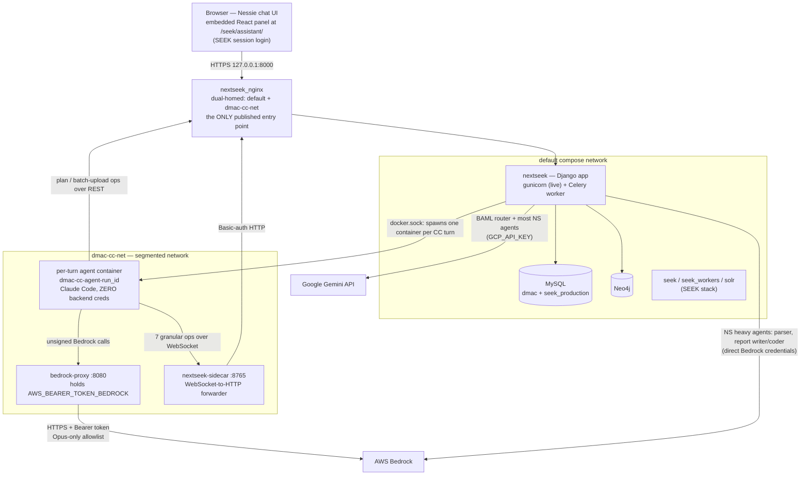
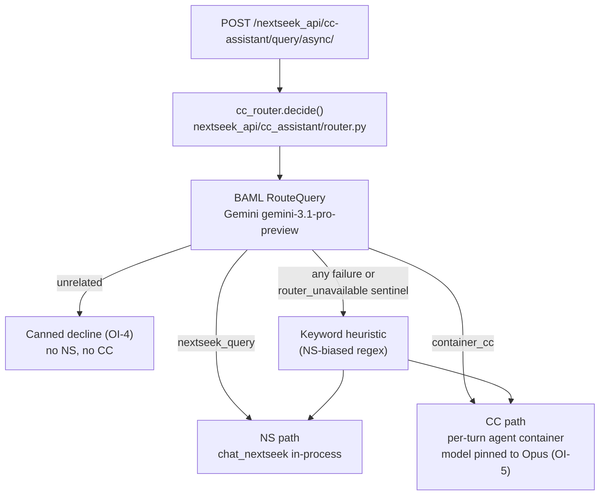
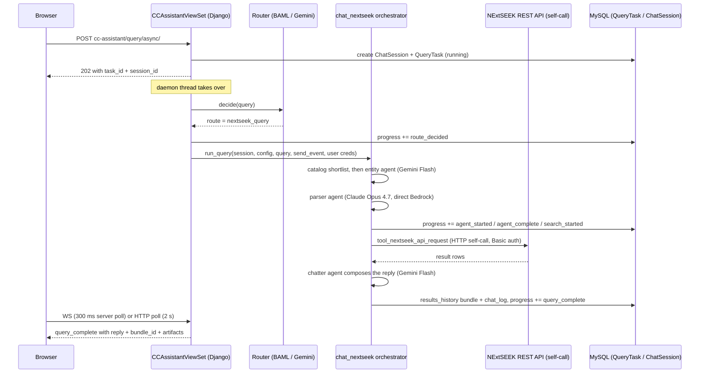
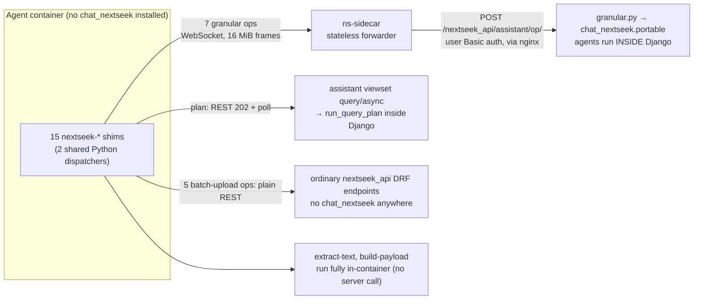
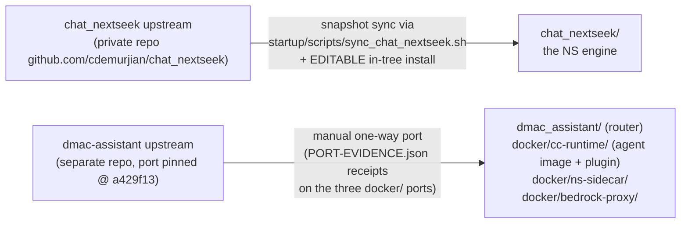

# Nessie — Architecture of the NExtSEEK Chat Assistant

> Generated from branch `merge/dev-into-feat` @ `01a1d1f`, 2026-07-12. All file paths are relative to the repo root. Every architectural claim below was verified against this checkout; where documentation and code disagree, the code is described and the doc drift is flagged.

**TL;DR** — Nessie is the chat assistant embedded in NExtSEEK at `/seek/assistant/`. Every chat turn enters through one Django endpoint, where an LLM router (BAML + Gemini) classifies it three ways: **NS path** — answered in-process by `chat_nextseek`, the first-party multi-agent engine; **CC path** — handed to a freshly spawned, sandboxed Claude Code container that lives for exactly one turn on a segmented Docker network with zero backend credentials; or **unrelated** — declined with a fixed canned reply, running no agent at all. The CC container's "tools" are mostly the same `chat_nextseek` functions repackaged as network ops: thin shims in the container call a sidecar or REST endpoints, and the actual agent code executes back inside Django. The whole CC complex (agent, `bedrock-proxy`, `ns-sidecar`) was ported in-tree from an upstream authoring repo, `dmac-assistant`.

---

## 1. The 30-second picture



**How to read this diagram**

- **One front door.** The browser submits every turn to `POST /nextseek_api/cc-assistant/query/async/` and gets a `202 {task_id, session_id}` back immediately. The turn runs on a background thread inside Django, and progress is read back via a WebSocket or HTTP polling (§2.1).
- **Three routes.** The router (§2.2) decides per turn: NS (in-process), CC (container), or unrelated (canned decline).
- **The segmented network is the security boundary.** The agent container joins `dmac-cc-net` only. It can reach exactly three things: the `bedrock-proxy` (its LLM calls), the `nextseek-sidecar` (data ops), and `nextseek_nginx` (REST as the logged-in user). It has **no** network path to MySQL, Neo4j, SEEK, Solr, or the Django container directly, and it carries no AWS/Neo4j/MySQL/GCP credentials (§5).
- **Two independent Bedrock paths.** The NS path's heavyweight agents (parser, report writer) call Bedrock **directly** from the Django container using its own credentials. The CC agent can only reach Bedrock **through the proxy**, unsigned. These must not be conflated.

**Naming decoder** (the single biggest source of confusion in this codebase):

| Name | What it actually is |
|---|---|
| **Nessie** | The user-facing brand. It exists *only* in the outer SEEK theme layer (`themes/NextSeek/templates/`, `themes/NextSeek/static/js/nextseek.js` — "Talk to Nessie", "Ask Nessie…"). The React app calls itself "NExtSEEK Chat"; no code identifier is named Nessie. |
| **chat_nextseek/** | The first-party in-tree assistant *engine* (multi-agent NS pipeline). A Python library imported directly by Django. |
| **dmac-assistant** | The *upstream authoring repo* (separate checkout, not in this tree) from which the router, agent image, sidecar, and proxy were ported. |
| **dmac_assistant/** (in-tree) | A vendored *subset* of that upstream repo: the BAML router package + build context, plus a few runtime helpers NExtSEEK also imports (`run_tracker.diff_files`, `config.ConfigError`; `streamjson` is present but unused). |
| **nextseek_api/assistant/** | Django subpackage holding the WebSocket consumer, the ORM models (`ChatSession`, `QueryTask`, `CCSessionTranscript`), and the granular-op dispatch. Despite the name, **not** where routing happens and **not** a separate Django app. |
| **nextseek_api/cc_assistant/** | The Container-CC Django app: router wrapper, container engine, memory, staging, transcripts. |
| **nextseek_api/services/{assistant,cc_assistant}.py** | The DRF ViewSets (the actual HTTP endpoints). Note: the ViewSets live under `services/`, not under `assistant/`. |

---

## 2. Anatomy of a turn

### 2.1 One front door, one progress store

Every turn — NS or CC — follows the same request skeleton, implemented in `CCAssistantViewSet` (`nextseek_api/services/cc_assistant.py`):

1. Browser POSTs `/nextseek_api/cc-assistant/query/async/` (`chat_frontend/src/lib/services/chatApi.ts`).
2. Django resolves/creates a `ChatSession`, creates a `QueryTask` row (`status='running'`), and returns **HTTP 202** with `{task_id, session_id}`.
3. The entire pipeline — router call included — runs on a **fire-and-forget daemon thread** inside the Django process (not Celery; Celery only handles file uploads on the `batch_upload` queue).
4. Every progress event is a synchronous ORM write appending `{event, data}` to `QueryTask.progress` (`nextseek_api/assistant/pipeline_adapter.py`). There is **no push channel or message bus**.
5. The browser reads progress two ways:
   - **WebSocket** `ws/assistant/progress/{task_id}/` — served by `TaskProgressConsumer` (`nextseek_api/assistant/consumers.py`), which itself DB-polls the `QueryTask` row every 300 ms and relays new events. Only available when the server runs **daphne** (ASGI).
   - **HTTP polling fallback** — if the WebSocket never opens, the client polls `GET /nextseek_api/assistant/tasks/{task_id}/progress/` every 2 s. Note the asymmetry: turns are *submitted* on the `cc-assistant` router but progress is *read back* on the legacy `assistant` router — both read the same `QueryTask` row.

**Deployment reality:** the container entrypoint (`docker/scripts/entrypoint.sh`) defaults to daphne, but the live deployment sets `NEXTSEEK_SERVER=gunicorn` (WSGI, no WebSocket) — so in production every turn effectively rides the HTTP polling fallback. The frontend's WS-failure try/catch masks this silently.

### 2.2 The BAML router

**What BAML is.** BAML is a prompt/schema definition language: you declare typed LLM functions in `.baml` files and a code generator emits a typed Python client. The router's source lives in `dmac_assistant/baml_src/`; the generated client (`baml_client/`) is gitignored and produced at Docker **build** time (`Dockerfile`, `baml-cli generate`).

**The three routes.** `dmac_assistant/baml_src/router.baml` defines:

```
enum Route {
  NextseekQuery  @alias("nextseek_query")   // deterministic NS pipeline
  ContainerCC    @alias("container_cc")     // sandboxed Claude Code agent
  Unrelated      @alias("unrelated")        // off-topic → canned decline
}
class RouterDecision {
  route        Route
  model_class  ModelClass?    // sonnet | haiku | opus
  reasoning    string
}
```

`RouteQuery(input) -> RouterDecision` runs on client **GCPReasoner** — Google Gemini **`gemini-3.1-pro-preview`** via the `google-ai` provider, authenticated by `GCP_API_KEY` (`dmac_assistant/baml_src/clients.baml`). The routing LLM is therefore **Gemini, called directly over HTTPS from the Django process** — never a container, never the bedrock-proxy. The prompt is capability-driven: `dmac_assistant/build_context/route_capabilities.json` describes each route's task families and example queries, and the prompt explicitly instructs sending off-topic/trivia/chit-chat to `unrelated`.

**Where the decision is made in code.** The single production call site is `CCAssistantViewSet._start_task → _run()` (`nextseek_api/services/cc_assistant.py`), which calls `cc_router.decide(query)` in `nextseek_api/cc_assistant/router.py`. That wrapper:

- lazy-imports dmac's `RouterAgent` and runs it synchronously (`asyncio.run`) inside the daemon thread;
- on **any** import/runtime failure — or when dmac's own fallback sentinel `<router_unavailable>` comes back — deliberately **discards** dmac's CC-biased default (ContainerCC/Sonnet) and substitutes its own NS-biased **keyword-regex heuristic**;
- translates the enum to local constants `ROUTE_NS` / `ROUTE_CC` / `ROUTE_UNRELATED`.

The forced-CC endpoint `POST /nextseek_api/cc-assistant/cc/query/async/` bypasses `decide()` entirely and fabricates a `ROUTE_CC`/opus decision.



**Two invariants worth naming:**

- **OI-4 (out-of-scope gate):** a query classified `unrelated` never reaches NS or CC — the thread emits one `query_complete` carrying a fixed canned decline and stops. Caveat: this gate is *BAML-dependent*. The heuristic fallback can only return NS or CC, so if Gemini is unavailable an off-topic query gets keyword-routed instead of declined.
- **OI-5 (model pin):** `model_class` is computed and logged but **does not select the CC model**. The CC route always runs the single `opus` entry of `dmac_assistant/build_context/router_model_class_map.json` (`us.anthropic.claude-opus-4-8`) — the only model the bedrock-proxy allowlists; a sonnet/haiku CC turn would 403 at the proxy. `model_class` is effectively vestigial today.

`router_model_class_map.json` is the single edit point for model IDs (opus → `us.anthropic.claude-opus-4-8`, sonnet → `us.anthropic.claude-sonnet-4-6`, haiku → `us.anthropic.claude-haiku-4-5-20251001-v1:0`); IDs are never hardcoded in BAML, Python, or Docker files.

### 2.3 An NS-path turn, end to end

The NS path runs `chat_nextseek.orchestrator.run_query` (or `run_query_plan` for planner mode) **in-process**, in the same daemon thread, with the calling user's own SEEK credentials.



Key mechanics:

- **Pipeline shape** (`chat_nextseek/src/chat_nextseek/orchestrator.py`): pipeline-agent gate → catalog shortlist → `entity_agent` → `parser_agent` → mode branch (`new_search` / `refine_last_search` / `graph_query` / `reporter` / `system_question` / `ask_about_last_results` / `unsupported`) → `chatter_agent`. `run_query_plan` instead runs a multi-parser → iterative planner/executor loop (max 5 steps) → evaluator.
- **Per-agent LLM routing** comes from `chat_nextseek/agent_model_catalog.json`: most agents (entity, api, chatter, graph, system, reporter) run `gemini-3.5-flash`; the heavy reasoning agents (parser, report_writer, report_coder, multi_parser) run `us.anthropic.claude-opus-4-7` with high thinking via **direct Bedrock** from the Django container's own `AWS_BEARER_TOKEN_BEDROCK`; memory runs `claude-sonnet-4-6`. (Naming trap: the catalog's `anth` provider maps to the Bedrock client, not the direct Anthropic API.)
- **Three data channels**, all synchronous: an HTTP **self-call** back into NExtSEEK's own REST API (`chat_nextseek/src/chat_nextseek/helpers/tools/nextseek_api.py`, base URL prefers `NEXTSEEK_INTERNAL_BASE_URL`); a per-call **Neo4j** bolt driver with a regex write-block that rejects `CREATE|MERGE|SET|DELETE|…` before execution (`helpers/tools/neo4j.py`); and direct **MySQL** reads for catalogs and project/investigation name→ID maps (`config.py`).
- **Persistence:** the reply and a compact turn summary go to `ChatSession.chat_log` (FIFO-capped at 50 turns) and a "bundle" dict into `results_history` via `DictSessionAdapter` (`nextseek_api/assistant/session_adapter.py`). Artifact **bytes** are written to disk under the outputs dir; only paths/metadata are stored in the DB. Downloads go through `GET /nextseek_api/assistant/sessions/{sid}/bundles/{bid}/artifacts/{key}/`, path-traversal-hardened via `Path.resolve()/relative_to()` containment.
- **Statefulness:** every agent is a stateless single LLM call per turn, except the nf-core **pipeline agent** (`chat_nextseek/src/chat_nextseek/pipeline/`), which holds one persistent Bedrock tool-calling conversation per session and gates ahead of the parser whenever active.

### 2.4 A CC-path turn, end to end

The CC path spawns **one ephemeral Docker container per turn** — there is no long-lived agent service. The orchestration lives in `nextseek_api/cc_assistant/cc_engine.py` (`run_cc_turn`).

```mermaid
sequenceDiagram
    participant B as Browser
    participant V as CCAssistantViewSet (Django)
    participant E as cc_engine
    participant A as Agent container (Claude Code)
    participant P as bedrock-proxy
    participant S as nextseek-sidecar
    participant G as Django granular ops
    participant DB as MySQL

    B->>V: POST cc-assistant/query/async/
    V-->>B: 202 with task_id
    Note over V: daemon thread: router says container_cc (Opus pinned)
    V->>V: resolve_user_project with the USER's own SEEK creds
    V->>V: Step-1c memory: summarize one changed prior session, render CLAUDE.md onto the volume
    V->>E: run_cc_turn(...)
    E->>A: docker-py containers.run on dmac-cc-net (subpath mounts, zero-cred env, claude --print [--resume])
    E->>A: one stdin JSON envelope, then close stdin
    A->>P: unsigned Bedrock calls
    P-->>A: Opus responses (proxy attaches Bearer server-side)
    A->>S: nextseek ops over WebSocket (entity, parse, graph, api-read, report, ...)
    S->>G: POST /nextseek_api/assistant/{op}/ via nginx, user Basic auth
    G-->>S: result (report artifacts staged under _staging)
    S-->>A: op result
    A-->>E: stream-json events (terminal frame deferred)
    Note over E: 180 s watchdog, budget via --max-budget-usd
    E->>E: staging sweep, scratch diff, publish artifacts
    E->>DB: zstd transcript row + CCTrace into extra_state
    E->>DB: progress += query_complete with reply, artifacts, cost_usd
    E->>A: stop + force-remove container (always, in finally)
    B->>V: WS or HTTP poll
    V-->>B: query_complete; CCActivityPanel renders the trace
```

Phase by phase:

**Spawn.** After the router decision, the view checks `cc_runner_available()` (fails closed if the docker daemon, the `dmac-assistant:poc` image, or the `dmac-cc-net` network is missing — the engine never creates the network itself), resolves the user's SEEK project with **their own credentials** (`cc_provision.py`; empty membership → an isolated `personal-<user>` namespace; anything unresolved is a hard error). `run_cc_turn` then regex-validates every user-controlled identifier *before* any path interpolation, builds 3–5 volume-subpath mounts (below), assembles the environment via the single audited `build_agent_environment()` function, and spawns via docker-py: image `dmac-assistant:poc`, network `dmac-cc-net`, deterministic name `dmac-cc-agent-<run_id>`, `detach + stdin_open`. The in-container command is headless Claude Code:

```
claude --print --input-format stream-json --output-format stream-json \
  --verbose --permission-mode auto --model <opus-id> \
  --max-turns 50 [--max-budget-usd 2.00] \
  --settings <auto-mode-allowlist.json> [--resume <cc_session_id>]
```

(The always-present `--settings` flag carries the auto-mode trusted-infrastructure allowlist — it tells Claude Code's permission classifier that the lab's own sidecar/REST calls are trusted, so the agent's data ops aren't aborted mid-turn.)

**Mounts** — all subpaths of the single external named volume `dmac-cc-users` (no host bind paths): `/data/input` (RO, user uploads), `/data/shared` (RO, project-scoped — deliberately no per-user segment), `/data/scratch` (RW — the only general write surface), `/home/user/.claude` (RW "cc-state", Claude Code's own on-disk session store), and `/home/user/.cc-memory/transcripts` (RO, staged prior-session transcripts).

**Ops.** Inside the container, Claude Code discovers the baked `nextseek` plugin (15 shims — full catalog in §3) and does its data work through the sidecar/REST, never in-process. An always-on `UserPromptSubmit` hook pre-runs `nextseek-entity-extract` to inject resolved NExtSEEK vocabulary into each prompt (fail-open).

**Streaming.** Exactly one stdin JSON envelope is written, then stdin closes — there is no interactive stdin protocol; multi-turn continuity is purely `--resume` against the persisted cc-state store (skipped if the store holds no transcript yet, so a wiped store starts fresh). Claude's stream-json stdout is translated by `translate.py` into five of the frontend's six progress events (`agent_started`, `search_started`, `search_complete`, `query_complete`, `query_error` — the sixth, `agent_complete`, is emitted only by the NS path); non-terminal frames stream live, while the terminal frame is **deliberately held back** until artifact publishing finishes so the reply can reference real downloadable files. Claude's native session UUID is surfaced as `cc_session_id` (never `session_id`) and persisted last-wins for the next turn's `--resume`.

**Traces, transcripts, artifacts.** After the stream ends: a trusted sweep (`cc_staging.py`) delivers this turn's sidecar-staged artifacts (`.complete`-marked, TOCTOU-hardened openat delivery) into the user's own `scratch/nextseek-artifacts/`; the scratch tree is diffed against a pre-spawn snapshot and partitioned into deliverable artifacts vs `raw/` debug output (`cc_artifacts.py`, zipped only if >1 file); the newest cc-state `*.jsonl` transcript is copied out, zstd-compressed (level 10, 256 MB decompress cap) into the durable `CCSessionTranscript` table, and distilled into a per-turn `CCTrace` (ordered steps, tool tally, cost, duration, files created/modified) folded into `ChatSession.extra_state` (`chat_log` + a FIFO-capped `cc_traces` mirror, cap 50). The frontend's `CCActivityPanel` renders that one persisted trace post-hoc — the live in-flight UI is the same generic stepper the NS path uses.

**Cost & budget.** Per-turn cost (`total_cost_usd`, `num_turns`, `duration_ms`) comes solely from Claude Code's terminal `result` frame. Spend is capped twice: Claude Code's own `--max-budget-usd` (code default $2.00; the live deployment overrides to **$0.50** via `NEXTSEEK_CC_MAX_BUDGET_USD`) plus `--max-turns 50`, and an independent wall-clock watchdog thread that stops and force-removes the container after `min(NEXTSEEK_CC_TIMEOUT_SECONDS, 180)` seconds. The container is **always** stopped and force-removed in a `finally` block, success or failure.

**Cross-session memory (Step 1c).** Before the container spawns, the view selects a window of the user's *other* sessions in the project, synchronously re-summarizes only the single most-recently-*changed* one (BAML `Summarize` on the cheap `gemini-3.5-flash` client, `cc_summary.py`; evidence quotes are re-verified against transcript bytes host-side; any failure degrades to a deterministic actions-only fallback), renders a merged memory markdown, and byte-copies it into the cc-state subpath as `CLAUDE.md` so the agent boots with prior-session context. Note the lazy shape: a session's summary is written not at the end of its own turn but at the start of some *future* turn that notices its transcript changed.

---

## 3. The op catalog & lineage

**The core insight:** most of the "dmac-assistant ops" the containerized agent calls are **pieces of `chat_nextseek` repackaged as standalone network ops**. The evolution ran: `chat_nextseek` functions → wrapped as sidecar ops in dmac-assistant → re-exposed as Django "granular" REST endpoints (`nextseek_api/assistant/granular.py`, dispatching to the curated `chat_nextseek.portable` surface) → called from thin `bin/` shims in the agent container. The agent container has **no `chat_nextseek` (or torch) installed at all** — for the lineage ops it is pure transport, and the agent logic executes back inside Django/gunicorn.



### The full 15-op lineage table

All 15 executables live in `docker/cc-runtime/build_context/plugins/nextseek/bin/`. "Executes in" = where the substantive logic runs.

| # | Op (executable) | Transport out of the agent | Server-side handler | chat_nextseek lineage | Executes in |
|---|---|---|---|---|---|
| 1 | `nextseek-entity-extract` | WS → ns-sidecar | `granular._entity` → `portable.entity_agent` | ✅ `agents/entity.py` | Django |
| 2 | `nextseek-parse` | WS → ns-sidecar | `granular._parse` → `entity_agent` + `parser_agent` (transient read-only session rebuilt server-side) | ✅ `agents/parser.py` | Django |
| 3 | `nextseek-graph` | WS → ns-sidecar | `granular._graph` → entity + parser + `graph_agent`, **then executes the Cypher** via `tool_neo4j_query` (superset of the dmac original, which returned the plan only) | ✅ `agents/graph.py` + Neo4j tool | Django (only Django touches Neo4j) |
| 4 | `nextseek-api-read` | WS → ns-sidecar | `granular._api_read` → `api_agent_build_request` + `tool_nextseek_api_request`; read-endpoint allowlist enforced server-side (`write_gate.py` + `read_safe_endpoints.json`, 15 entries) | ✅ `agents/api.py` + REST tool | Django |
| 5 | `nextseek-api-write` | WS → ns-sidecar | `granular._api_write` — same chain, gated: `confirmed_write` must be the literal boolean `True`, checked at shim, sidecar, **and** Django | ✅ `agents/api.py` + REST tool | Django |
| 6 | `nextseek-report` | WS → ns-sidecar | `granular._report` → `run_reporter_summary`; sidecar then fetches produced artifacts over HTTP and stages them under `_staging/` | ✅ `reports/runners.py` | Django |
| 7 | `nextseek-generate-submission` | WS → ns-sidecar | `granular._generate_submission` → `generate_report_outputs` (+ `report_writer_agent`) producing real GEO/SRA/PRIDE workbooks; artifacts staged like report | ✅ `reports/outputs.py` | Django |
| 8 | `nextseek-plan` | **Direct REST** (`POST /nextseek_api/assistant/query/async/` → 202 → poll progress) — bypasses the sidecar | `AssistantViewSet.query_async` plan branch → `orchestrator.run_query_plan` (multi-parser + planner loop) on a Django daemon thread | ✅ `orchestrator.py` + `agents/planner/` | Django |
| 9 | `nextseek-sampletype-attrs` | Direct REST | plain `GET /nextseek_api/sample_types/…` (ordinary DRF ViewSet) | ❌ none | Agent container (logic) + DRF reads |
| 10 | `nextseek-extract-text` | **None — fully local** | — (MarkItDown/pdfplumber/python-docx, zero network) | ❌ none | Agent container |
| 11 | `nextseek-project-resolve` | Direct REST | plain `GET /nextseek_api/projects/`; mints a local non-secret confirmation token | ❌ none | Agent container + DRF reads |
| 12 | `nextseek-assay-resolve` | Direct REST | plain `GET /nextseek_api/assays/`, `/projects/{id}/` | ❌ none | Agent container + DRF reads |
| 13 | `nextseek-sample-search` | Direct REST | plain `POST /nextseek_api/samples/advanced_search/` (UID exact match only) | ❌ none | Agent container + DRF reads |
| 14 | `nextseek-build-payload` | Local (optional REST re-resolve) | local polars workbook builder (`_batch_upload_payload.py`) | ❌ none | Agent container |
| 15 | `nextseek-validate-upload` | Direct REST | builds the workbook locally, then `POST /nextseek_api/batch-upload/validate/` → `run_validation_multi` — the **pre-existing Django batch-upload engine** (zero chat_nextseek imports; the same engine behind the human upload UI). Validation only; `batch-upload/start/` is never called and is explicitly forbidden. A second client-side hard gate re-checks the server result before promoting the file. | ❌ none (reuses `nextseek_api/batch_upload/` instead) | Agent container + Django batch_upload engine |

**Scorecard:** the "repackaged chat_nextseek" story is true for **8 of 15** ops (rows 1–8) and false for the 7-op batch-upload family (rows 9–15), which is a purpose-written client library over ordinary REST endpoints plus the separate Django batch-upload engine.

Three details a reader will otherwise get wrong:

- **On this branch there is no `nextseek-query` front-door op.** The dispatcher (`_nextseek_runner.py`) retains a latent `query` entry, but no shim ships and the plugin manifest lists only the 8 per-op tools. (Upstream dmac-assistant *does* ship a `nextseek-query` shim; it was not ported here.)
- **`nextseek-plan` looks like a sidecar op but isn't** — it goes straight to the assistant viewset over REST and polls, an async boundary the other granular ops don't have.
- **Write safety is 3-layered, and the layers are unequal.** L1 is a Claude Code permission allowlist installed at container start (omits `api-write`) — explicitly defense-in-depth only under `--permission-mode auto`. The load-bearing layers are L2 (server-side `write_gate` requiring strict-boolean `confirmed_write`, enforced in the sidecar *and* Django) and L3 (behavioral: the agent must obtain a plain-text "confirm" from the user; `AskUserQuestion` is banned because the chat UI can't render it).

---

## 4. chat_nextseek ↔ dmac-assistant: who wrote what

Two different upstreams feed this tree, in two different ways:



### chat_nextseek — the first-party engine (with a framing nuance)

`chat_nextseek/` is the multi-agent engine behind both the NS path and (via the granular ops) most of the CC path's tools. Two framings coexist in the repo, and both are real:

- **The maintainer-workflow framing:** the repo-root `CLAUDE.md` calls it a "vendored subpackage", synced as a snapshot from the external private repo by `startup/scripts/sync_chat_nextseek.sh`.
- **The integration reality on this branch:** the root `pyproject.toml` installs it as an **editable in-tree path dependency**, with a comment declaring it first-party ("one source of truth … not a divergent site-packages copy") and a commented-out pinned-git install to be restored "when chat_nextseek goes public".

So: the *live dependency resolution* is first-party/editable in-tree; the *vendor-and-sync workflow* remains the documented maintenance path. An accurate mental model holds both. Django consumes it strictly as a Python library (`from chat_nextseek.orchestrator import run_query, run_query_plan`; granular ops import from `chat_nextseek.portable`, a curated 12-symbol public surface). Its standalone surfaces (Streamlit `app.py`, `cli.py`, `mcp_server.py`) are never used by the Django app.

### dmac-assistant — the upstream authoring repo for the CC complex

dmac-assistant is a separate repo where the container-agent architecture was designed and built. Four of its components were ported in-tree; the three `docker/` ports each carry a `PORT-EVIDENCE.json` receipt pinning the same upstream commit (`a429f13…`), while the `dmac_assistant/` router port has no receipt file:

| In-tree location | Ported from dmac-assistant | Fidelity |
|---|---|---|
| `dmac_assistant/` | `src/dmac_assistant/router/` + `baml_src/` + `build_context/` | Runtime subset only — the FastAPI bridge (`app.py`/`auth.py`/`ws.py`) was deliberately **not** vendored; NExtSEEK's own Django layer replaces it. `baml_src/` is byte-identical to upstream. |
| `docker/cc-runtime/` | container image + `nextseek` plugin | Diverged forward: NExtSEEK added hooks/, MANIFEST.md, batch-upload client perf work; upstream's `nextseek-query` shim was dropped. Also carries a **byte-identical duplicate** of `baml_src/` used only by an offline E2E judge — do not conflate the two copies. |
| `docker/ns-sidecar/` | `sidecar/app/` | All 11 `.py` files byte-identical; only Dockerfile paths adapted. |
| `docker/bedrock-proxy/` | `bedrock-proxy/app/` | All 3 `.py` files byte-identical. |

The port is **manual and one-way** (copy + receipt, no live sync or submodule), and the relationship is asymmetric in visibility: dmac-assistant's own design docs never mention NExtSEEK as a consumer — the receipts live entirely on this side.

**Closing the loop on lineage:** dmac-assistant's ops were themselves originally in-process `chat_nextseek` calls; a 2026-06-14 refactor upstream removed `chat_nextseek` + torch from the agent image (4.95 GB → 1.35 GB) and rewired the ops as thin network clients to server-side endpoints. NExtSEEK's granular endpoints are the server side of that contract — which is why "a dmac-assistant op" and "a chat_nextseek function running inside Django" are usually the same thing viewed from opposite ends of a WebSocket.

Small vestiges of the port worth knowing: `dmac_assistant.streamjson` is claimed by its README/pyproject as used by NExtSEEK but is never imported (CC stream parsing is inline stdlib `json.loads` in `cc_engine.py`); only `run_tracker.diff_files` and the `ConfigError` class are reused from the old bridge modules.

---

## 5. Deployment & security

### Compose topology

One docker-compose stack (project `nextseek`), served at `https://nextseek-dev.mit.edu` via host `127.0.0.1:8000`. Login is SEEK session auth (not MIT SSO). Ten services:

| Service | Network(s) | Host port | Role |
|---|---|---|---|
| `nextseek` | default | — | Django app. Entrypoint toggle `NEXTSEEK_SERVER=gunicorn\|daphne` (unset default: daphne; **live: gunicorn**, WSGI, 4 workers) + an always-on Celery `batch_upload` worker. Mounts `/var/run/docker.sock` (to spawn agents) and the whole `dmac-cc-users` volume at `/dmac/users`. |
| `nextseek_nginx` | **default + dmac-cc-net (only dual-homed service)** | `127.0.0.1:8000→80` | Reverse proxy; rewrites Host→localhost; WS-upgrade aware; **the agent's and sidecar's only route back into NExtSEEK**. |
| `db` (MySQL) | default | `127.0.0.1:3306` (hardcoded) | Two schemas: `dmac` (Django/assistant tables) + `seek_production` (SEEK). |
| `neo4j` | default | 7474 / 7687 | Sample-lineage graph. No Project nodes — reached only server-side. |
| `seek`, `seek_workers` | default | 3000 (`seek` only; workers publish nothing) | SEEK (FAIRDOM) app + workers. |
| `solr` | default | — | SEEK search. |
| `bedrock-proxy` (container `dmac-bedrock-proxy`) | **dmac-cc-net only** | — (internal :8080) | Holds `AWS_BEARER_TOKEN_BEDROCK` (runtime env-file, never baked); strips client Authorization; exact-match allowlist: the two `us.anthropic.claude-opus-4-8` invoke routes plus a read-only `GET /inference-profiles`; 10 MiB body cap; fixed upstream `bedrock-runtime.<region>.amazonaws.com`. |
| `nextseek-sidecar` | **dmac-cc-net only** | — (internal WS :8765) | Stateless WS→HTTP forwarder. Env carries zero secrets (`NEXTSEEK_BASE_URL=http://nextseek_nginx` + staging dir + port); per-request user credentials arrive *inside* WS frames. Mounts **only the `_staging` subpath** of `dmac-cc-users` — it structurally cannot write any user's tree. |
| `cc-agent` | none (`network_mode: none`, `command: ["true"]`) | — | **Build target only** — exists so `docker compose build` produces the `dmac-assistant:poc` agent image. An accidental `up` is a harmless no-op. It is *not* the running agent. |

**The real agent containers are not compose services.** Per CC turn, `cc_engine.py` spawns a sibling container via docker-py through the mounted docker socket: `dmac-cc-agent-<run_id>`, joined to `dmac-cc-net` at run time, destroyed at turn end. `dmac-cc-net` itself is compose-managed with a pinned literal name; its compose-wired members are exactly three — `nextseek_nginx`, `bedrock-proxy`, `nextseek-sidecar` (a stale compose comment claims two; the code and compose stanzas say three).

**The `dmac-cc-users` volume** is the one external named volume of the CC complex: per-project/per-user trees (`{project}/{user}/{input,scratch,output,cc-state,_memory}` plus project-scoped `shared/` and the reserved `_staging/`). Django mounts it whole; each agent gets only per-user **subpath** mounts; the sidecar gets only `_staging`. Artifact delivery from `_staging` into user trees is done exclusively by trusted Django code (`cc_staging.py`).

### The OI-3 security invariants (what must never regress)

1. **Zero credentials in the agent.** The container env is built by one audited function (`build_agent_environment`, `cc_engine.py`) that emits only non-secret settings: Bedrock-via-proxy plumbing (`CLAUDE_CODE_USE_BEDROCK=1`, `ANTHROPIC_BEDROCK_BASE_URL=http://bedrock-proxy:8080`, `CLAUDE_CODE_SKIP_BEDROCK_AUTH=1`, `AWS_REGION` when set), the end user's own NExtSEEK login, the nginx-rewritten base URL, sidecar host/port, and auto-mode/path-mapping plumbing (`CLAUDE_CODE_ENABLE_AUTO_MODE=1`, `DMAC_PATH_MAPPINGS`). `AWS_BEARER_TOKEN_BEDROCK`, `GCP_API_KEY`, `NEO4J_PASSWORD`, `MYSQL_*`, `ANTHROPIC_API_KEY` are never present (and sit on a belt-and-suspenders log-redaction denylist alongside `DMAC_PATH_MAPPINGS`, which encodes host layout). A containment canary test feeds the same function a hostile source.
2. **Bedrock only via the proxy.** The agent's LLM calls are unsigned; the proxy alone holds the institutional token, attaches it server-side, and allowlists exactly the Opus invoke routes (plus one read-only `GET /inference-profiles`). No host port is published.
3. **Segmented network.** The agent lives on `dmac-cc-net` only; it has no L3 path to Django, MySQL, Neo4j, SEEK, or Solr. Everything it does against NExtSEEK goes through nginx as the authenticated end user; everything Neo4j/MySQL happens server-side inside Django.
4. **Scratch-only writes.** Of the agent's mounts, only `/data/scratch` and its own `/home/user/.claude` state dir are writable; input/shared/transcripts are read-only. Artifacts leave the sandbox only through the scratch diff + trusted sweep.

Complementing OI-3: **OI-4** (unrelated queries get a canned decline, never an agent) and **OI-5** (CC always runs the pinned Opus tier) from §2.2, plus the operational caps: 180 s hard wall-clock watchdog, `--max-turns 50`, `--max-budget-usd` ($0.50 in the live deployment), and a single-model proxy allowlist as the financial backstop.

**Rollback:** a pristine pre-integration image (`nextseek-nextseek:dev-rollback`) plus a script restores the pure-native stack in about a minute — the integration is additive and removable.

---

## 6. Where things live

```
chat_frontend/                    React/Vite chat UI (one src tree, standalone + embedded builds;
                                  embedded build lands in static/js/chat_assistant/, served by
                                  seek/templates/smartSearch.html at /seek/assistant/)
themes/NextSeek/                  SEEK dashboard theme — the only place the name "Nessie" exists
chat_nextseek/                    First-party NS engine (agents/, reports/, seqera/, orchestrator.py,
                                  portable.py, agent_model_catalog.json; editable-installed in-tree)
dmac_assistant/                   Vendored router subset of upstream dmac-assistant
  baml_src/                       Router + Summarize BAML source (client generated at image build)
  build_context/                  route_capabilities.json, router_model_class_map.json
nextseek_api/
  services/assistant.py           Legacy/granular DRF ViewSet (sessions, progress poll, 7 granular ops)
  services/cc_assistant.py        CCAssistantViewSet — the front door; router dispatch; NS/CC/unrelated
  assistant/                      WS consumer, ORM models (ChatSession/QueryTask/CCSessionTranscript),
                                  granular.py, write_gate.py, session/pipeline adapters
  cc_assistant/                   CC engine: router.py, cc_engine.py, cc_provision.py, cc_memory*.py,
                                  cc_summary.py, cc_staging.py, cc_trace.py, cc_transcript_store.py,
                                  translate.py, attach.py
  batch_upload/                   Pre-existing batch-upload engine (also behind nextseek-validate-upload)
docker/
  cc-runtime/                     Agent image build (Claude Code + nextseek plugin, 15 op shims)
  ns-sidecar/                     WS→HTTP forwarder image
  bedrock-proxy/                  Token-holding LLM relay image
  nginx.conf, scripts/entrypoint.sh
docker-compose.yml                10 services, dmac-cc-net, dmac-cc-users
startup/                          Install CLI (9-step bring-up, volumes, env templates)
```

---

## 7. Glossary

| Term | Meaning |
|---|---|
| **Nessie** | User-facing brand of the NExtSEEK chat assistant (UI theme layer only). |
| **NS path** | "NextSEEK query" route: the turn is answered in-process by `chat_nextseek`'s multi-agent pipeline inside Django. |
| **CC path** | "Container-CC" route: the turn is delegated to a per-turn sandboxed Claude Code agent container. |
| **BAML** | Typed prompt/schema language; declares the router's `RouteQuery` and memory `Summarize` functions; client code is generated at image build. |
| **Router** | The per-turn 3-way classifier (`nextseek_query` / `container_cc` / `unrelated`), run on Gemini `gemini-3.1-pro-preview`, with a keyword-heuristic fallback. |
| **OI-3 / OI-4 / OI-5** | Standing invariants: agent isolation (zero creds, proxy-only Bedrock, segmented net, scratch-only writes) / unrelated-query canned decline / CC model pinned to Opus. |
| **Granular op** | One of the 7 per-agent REST endpoints (`/nextseek_api/assistant/{entity,parse,graph,api-read,api-write,report,generate-submission}/`) exposing individual `chat_nextseek` functions server-side. |
| **Sidecar (`ns-sidecar`)** | Credential-less WebSocket→HTTP forwarder on `dmac-cc-net` that relays the agent's granular-op calls to Django (per-request user Basic auth carried inside frames) and stages report artifacts under `_staging/`. |
| **bedrock-proxy** | The only holder of the institutional Bedrock token; relays the agent's unsigned LLM calls with an Opus-only allowlist. |
| **Portable surface** | `chat_nextseek/src/chat_nextseek/portable.py` — the curated 12-symbol public API that granular ops (and formerly the dmac sidecar) import; the stability contract for external reuse. |
| **`dmac-cc-net`** | The segmented Docker network isolating the CC complex; nginx is the only bridge back to the main stack. |
| **`dmac-cc-users`** | External named volume holding per-project/per-user CC trees; agents mount only per-user subpaths, the sidecar only `_staging`. |
| **cc-state / `--resume`** | Claude Code's own on-disk session store (`/home/user/.claude`), persisted per chat session on the volume; `--resume <cc_session_id>` replays it into each fresh container. |
| **`QueryTask`** | The shared per-turn progress row (JSON event log + status/result) that both the WebSocket consumer and the HTTP poll endpoint read. |
| **CCTrace** | The per-CC-turn distilled record (steps, tools, cost, duration, changed files) stored in `ChatSession.extra_state` and rendered by the UI's activity panel. |
| **stream-json** | Claude Code's line-delimited JSON stdout protocol, translated into five of the frontend's six chat events (all but `agent_complete`). |
| **Step 1c** | Cross-session memory: prior-session summaries (Gemini Flash `Summarize`, deterministic fallback) rendered into the agent's `CLAUDE.md` before each CC turn. |
| **Granular vs batch-upload families** | The two op groups in the agent plugin: 8 chat_nextseek-lineage ops (7 sidecar + plan) vs 7 lineage-free batch-upload ops over plain REST. |
