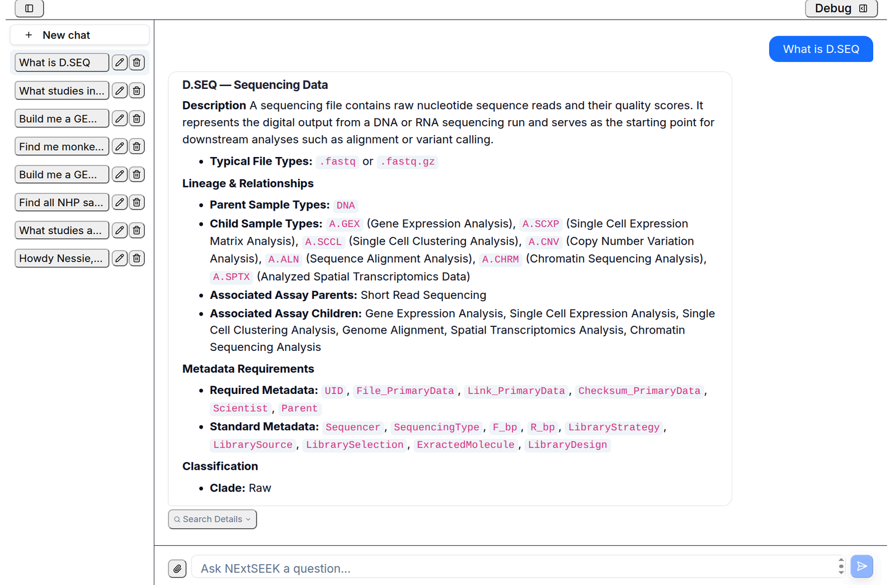
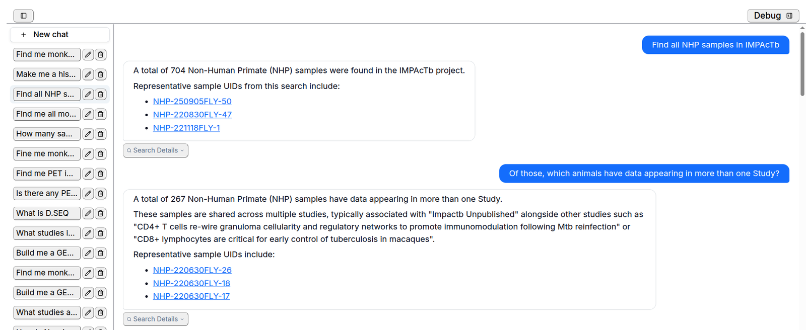

# Nessie, the assistant

Nessie is a chat assistant for NExtSEEK. You ask in plain language and it looks the answer up in your NExtSEEK data. You do not need query syntax.

## Open Nessie

Click **Ask Nessie** in the sidebar, or go to `/seek/assistant/`. You must be signed in.

The left rail lists your saved chats. Use **New chat** to start a fresh one, and the pencil and bin icons to rename or delete a chat. Type in the box at the bottom and press Enter. Shift+Enter starts a new line. The paperclip attaches files for Nessie to work with.

Nessie sees the same projects you do. It never shows you samples from projects you are not a member of.

## What you can ask

| Kind of question | Example |
|---|---|
| Find samples | Find all NHP samples in IMPAcTb |
| Counts and breakdowns | How many tissue samples have Organ set to lung? |
| Lineage | What was made from this sample? |
| Catalogs | What assays and sample types exist? Which projects are there? |
| The system itself | What is D.SEQ? What can you do? |
| Files to take away | Write a CSV of these samples |
| Deposit workbooks | Build a GEO deposit file for these UIDs |
| Upload sheets | Prepare an upload workbook that fixes a value on these samples |

<figure>
  
  <figcaption>A question about the system itself. Nessie describes a sample type, its parents and children, and what metadata it needs.</figcaption>
</figure>

The first group of questions runs on the [sample graph](graph-search.md).

## Follow-up questions

Nessie remembers the chat. Ask a second question that refers to the first, such as "of those" or "which of them".

<figure>
  
  <figcaption>A question and a follow-up. The second one narrows the first answer.</figcaption>
</figure>

UIDs in an answer are links to the sample page. Under the newest answer you may see suggestion buttons. Click one to ask it. Start a **New chat** when you change topic, so old answers do not shape new ones.

## Search Details

Under each answer, click **Search Details** to see how Nessie got it: what it searched for and the steps it took. Use it to confirm that Nessie understood your question.

## What Nessie changes

Nessie does not create, edit or delete your samples, metadata or assay links. Asked to do so, it tells you to make the change in NExtSEEK. It can prepare the material for you:

* **Upload sheets.** It builds and checks a workbook. You review it and upload it yourself, see [Uploading](uploading.md).
* **Deposit workbooks.** It builds files for GEO, SRA or PRIDE from a set of UIDs.
* **Files.** It can write tables and charts to files you download.
* **Pipeline runs.** On sites that connect a compute cluster, it can build an nf-core samplesheet and step you through starting a run. That run is the one action that goes beyond reading, so check what it proposes.

## What Nessie cannot do

* Delete or edit records. Use the upload pages or SEEK.
* Answer questions about data outside NExtSEEK, or explain general science.
* Run statistical tests or say whether one group differs from another. It can count and list.
* Reach samples in projects you do not belong to.

## Check the answer

Answers can be wrong. Nessie can misread a question, match the wrong word, or give a count that leaves something out. Before you rely on a number:

1. Open **Search Details** and read what was searched.
2. Run the same search in [Sample Search](searching-downloading.md) and compare the counts.
3. Open a few of the UIDs it lists.

If a count differs, trust Sample Search and tell the data team through the Contact link in the footer.
