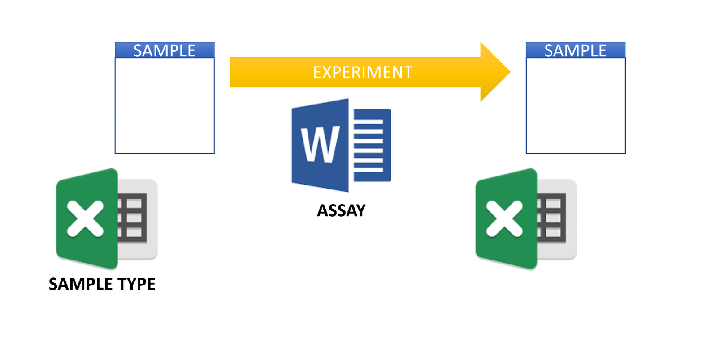

# Overview

NExtSEEK is a layer built over [FAIRDOM-SEEK](https://seek4science.org/) for the active management of data from research projects that are still running. SEEK is built as a repository for finished work. NExtSEEK adds two things so you can use it while the work is going on:

- **Hard sample typing.** Every sample belongs to a sample type, and each type has its own set of typed metadata fields.
- **Assays as edges.** An assay is the link between two samples, not a box that holds them. Together the samples and assays form a network that follows the real experiment.

It was developed at the [MIT BioMicro Center](https://openwetware.org/wiki/BioMicroCenter) / Koch Institute Integrated Genomics and Bioinformatics Core Facility.

## What it looks like

<figure>
  
  <figcaption>A sample, an experiment (the assay) and a new sample. This is the whole model. See <a href="data-model.md">The data model</a>.</figcaption>
</figure>

## Who uses it

NExtSEEK works best as a private instance that holds data before publication, so that a group or consortium can share data and metadata among its members. Today it manages data for these projects, plus independent project work:

| Project | Link |
|---|---|
| HI-IMPAcTB | [NIAID program page](https://www.niaid.nih.gov/research/immune-mechanisms-protection-mycobacterium-tuberculosis) |
| MIT Superfund Research Program (SRP) | [superfund.mit.edu](https://superfund.mit.edu/) |
| Metastasis Network of Cancer (MetNet) | [NIH RePORTER](https://reporter.nih.gov/search/yoc2JaX_LU23-SGX943zLA/project-details/10271565) |
| Cancer Systems Biology Consortium (CSBC) | [NCI program page](https://www.cancer.gov/about-nci/organization/dcb/research-programs/csbc) |
| Break Through Cancer (BTC) | [breakthroughcancer.org](https://breakthroughcancer.org/) |
| CRG-Griffith | |

Each project has a project page with its overview, a sample flow graph and templates. See [Projects and templates](projects-and-templates.md). For how many samples each project holds, see [Statistics](statistics.md).

## Where published data goes

When a study is published, its data and metadata are deposited in [FAIRDOMHub](https://fairdomhub.org/), the public repository run by the SEEK team. The public studies of these projects are listed under the [Published Studies](https://fairdomhub.org/programmes/206) link in the sidebar.

## Where to start

| You want to | Read |
|---|---|
| Get an account and find your way around | [Using NExtSEEK](using-nextseek.md) |
| Understand samples, sample types and assays | [The data model](data-model.md) |
| Add samples, data files or protocols | [Uploading](uploading.md) |
| Find and download data | [Searching and downloading](searching-downloading.md) |
| Ask questions in plain language | [Nessie, the assistant](nessie.md) |

If you want to run your own NExtSEEK instance, see [Installation](installation.md).

## Cite NExtSEEK

Pradhan D, Ding H, Zhu J, Engelward BP, Levine SS. NExtSEEK: Extending SEEK for Active Management of Interoperable Metadata. J Biomol Tech 2022;33(1). [https://doi.org/10.7171/3fc1f5fe.db404124](https://doi.org/10.7171/3fc1f5fe.db404124)
