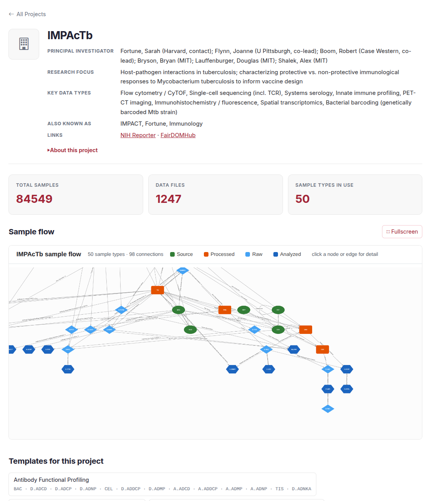
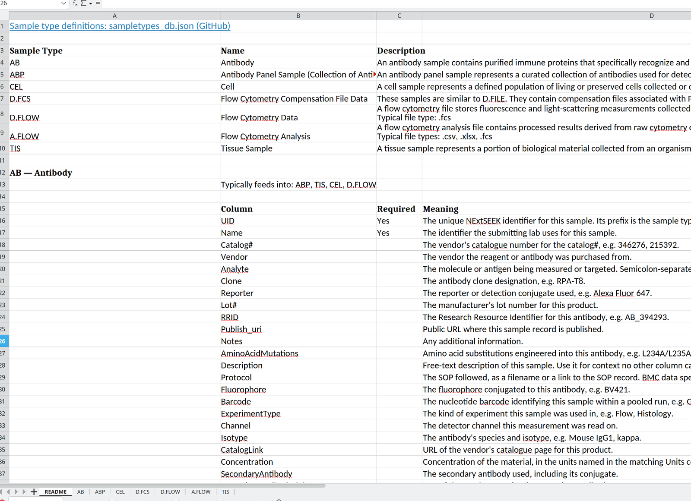

# Projects and templates

Each project has its own page. It shows what the project is about, how much data it holds, how its sample types connect, and which templates to use to prepare an upload.

## The projects list

Open **Projects** in the sidebar. You see the projects you can access, each as a card. You need to be signed in, and a project page opens only if you belong to that project.

## The project page

<figure>
  
  <figcaption>A project page: the summary, three stat cards, the Sample flow and the project's templates.</figcaption>
</figure>

From top to bottom, the page has:

- **A summary.** Principal investigators, research focus, key data types, other names for the project, and links to public pages such as NIH RePORTER and FAIRDOMHub. "About this project" opens a longer description.
- **Three stat cards.** Total samples, data files and sample types in use. Total samples opens the count by sample type, and data files opens the data file query.
- **Sample flow.** A graph of the project's sample types and the assays between them. See below.
- **Templates for this project.** Ready-made template workbooks for the project's common experiments.
- **Sample types in use.** Each code links to its page in [Sample types](sample-types.md).

The sample counts and the graph are read from the project's records, so a section that is empty may mean the data could not be loaded, not that the project has none.

### Sample flow

The Sample flow is the project's sample-type graph from [The data model](data-model.md#a-projects-sample-types-form-a-graph). Colour and shape show the clade: green ovals for source, orange boxes for processed, light blue diamonds for raw and dark blue hexagons for analyzed. Click a node or an edge to see details. Use **Fullscreen** to open a bigger view.

## Templates

A template is an Excel workbook that describes the sample types you pick: every column, which ones are required and what each one means. Use it to plan and collect your metadata. The upload page does not read this workbook yet: copy your rows into an upload workbook, see [Uploading](uploading.md).

There are two places to get one:

- **The templates page.** Open **Useful Info**, then [Templates](/seek/templates/) in the sidebar. You need to be signed in. Tick the sample types you want, then choose **Download workbook**. The page also suggests types that are commonly used together.
- **A project page.** Under "Templates for this project", each button downloads the workbook for one common experiment, such as Flow Cytometry or DNA Extraction.

### What is in the workbook

<figure>
  
  <figcaption>The README sheet. It defines every sample type and every column in the workbook.</figcaption>
</figure>

The workbook has these sheets:

| Sheet | What it holds |
|---|---|
| README | A table of the sample types you chose with their names and descriptions. Where the workbook can show it, a tree of how they connect. Then, for each type, the types it is usually derived from and feeds into, and a table of its columns with a Yes in the Required column for the ones you must fill and a meaning for each |
| One sheet per sample type | Only the column headers. Required columns are marked with an asterisk. Hover over a header to read a short note on what to enter. Some columns offer a dropdown of allowed values |
| Controlled Vocabularies | The lists the dropdowns use. It is added, hidden, when a column has a dropdown |

Another hidden sheet maps each column to its database field, for a later upload step. Leave it as it is.

Fill in one sheet per sample type and keep the headers unchanged. The Parent column names the sample each row came from, which is how the lineage is built. [Uploading](uploading.md) describes the workbooks the upload page reads.
