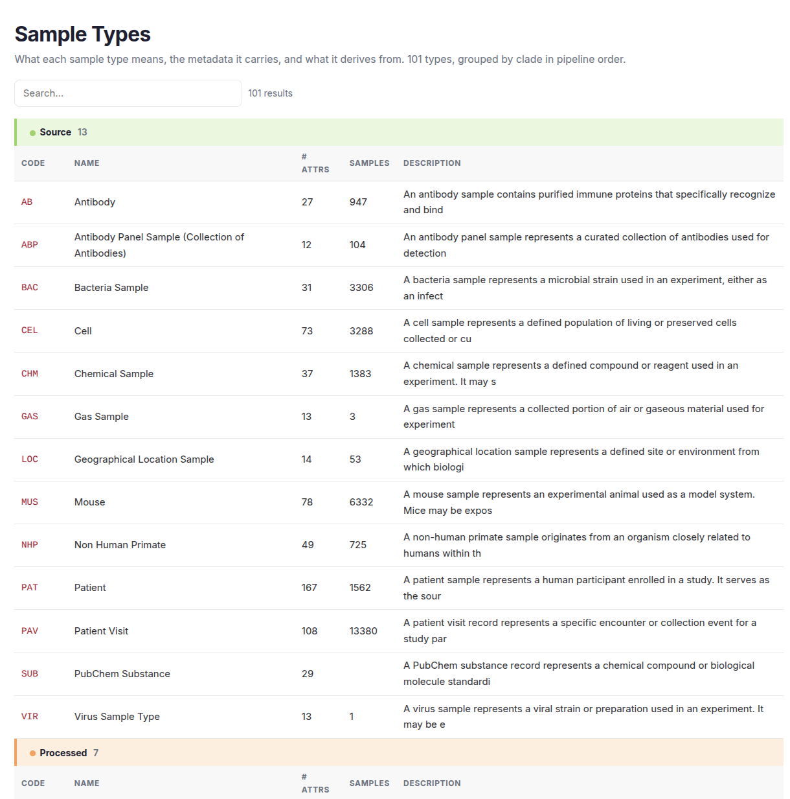
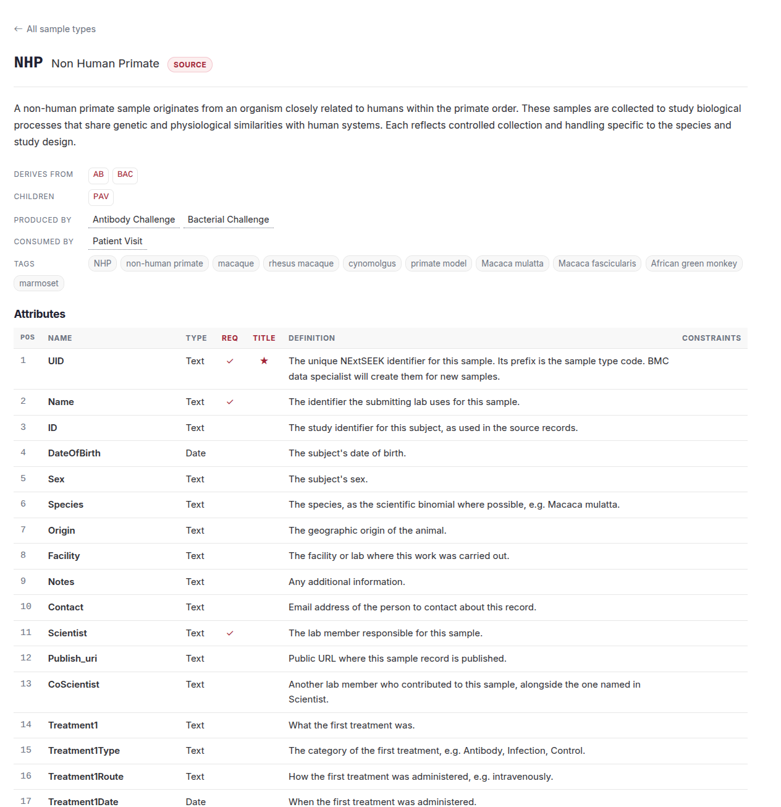

# Sample types

Every record in NExtSEEK is a sample, and every sample has a **sample type**. The type is a template: it says which attributes the sample carries, which types it comes from and which types come from it.

## What a sample type is

A sample type is a named schema. A mouse and a tissue sample are different types because they carry different fields. When you upload samples, you pick the type, and the upload sheet has the columns that type defines.

Each type has:

* a **code**, the short prefix of every UID of that type
* a name and a description
* a **clade** (see below)
* attributes, some required and some optional
* parent types (derives from) and child types
* tags, the extra words people search by

## The code

The code is the prefix of the sample's UID. A mouse sample has a UID that starts with `MUS`, a sequencing data file with `D.SEQ`, and a gene expression analysis with `A.GEX`.

| Code | Name | Clade |
|---|---|---|
| `NHP` | Non Human Primate | Source |
| `TIS` | Tissue Sample | Processed |
| `D.SEQ` | Sequencing Data | Raw |
| `A.GEX` | Gene Expression Analysis | Analyzed |

NExtSEEK makes the UID when you upload a new sample. You do not make them up. See [Uploading](uploading.md).

## The four clades

Sample types are grouped into four **clades**. A clade is a stage in the life of the data, from the thing you start with to the result you publish. The [data model](data-model.md) page shows how the clades connect.

| Clade | What it holds | Code style |
|---|---|---|
| Source | Organisms and starting materials: mice, cell lines, patients, chemicals | Short codes: `MUS`, `CEL`, `PAT`, `CHM` |
| Processed | Physical products made from a source: tissue, DNA, RNA | Short codes: `TIS`, `DNA`, `RNA` |
| Raw | Instrument output, one data-file type per kind of measurement | `D.` prefix: `D.SEQ`, `D.FLOW`, `D.IMG` |
| Analyzed | Results of analyzing raw data, and models | `A.` prefix: `A.GEX`, `A.TITR`. Models use `M.` or `MDL` |

## Required and optional attributes

Every attribute has a name, a type (text, date and so on) and a definition. Some are required: a sample cannot be uploaded without them.

* Every type requires a **UID**. Almost every type also requires a **Scientist**, the lab member responsible, and Source and Processed types require a **Name**.
* Types in the Raw and Analyzed clades, and most Processed types, also require a **Parent**, the sample they came from.
* Raw and Analyzed data-file types also require the file, a link to it and, for nearly all of them, a checksum.
* Everything else is optional. Fill in as much as you know: optional fields are what make samples findable later.

The detail page of each type lists its attributes, marks the required ones and shows the definition of each.

## Parents and children

A type lists the types it **derives from** and the types that derive from it. A patient visit (`PAV`), for example, derives from an `NHP`, a patient or a mouse, and tissue (`TIS`) derives from a patient visit. An assay is what turns parents into children: see [Assays](assays.md).

## Tags

Tags are alternative names for a type ("macaque", "rhesus macaque" and "primate model" for NHP). Search and [Nessie](nessie.md) use them to match what you type to the right type.

## Browse every sample type

The live catalog is always current. It lists every type grouped by clade, with a filter box.

[Open the Sample Types catalog](/seek/sampletypes/) (you need to be signed in).

<figure>
  
  <figcaption>The catalog, grouped by clade.</figcaption>
</figure>

Click a code to open the detail page. It shows the definition, what the type derives from, its children, the assays that produce and consume it, its tags and every attribute. From there you can download the upload template for that type or search its samples.

<figure>
  
  <figcaption>One type's detail page.</figcaption>
</figure>

## Need a new type or attribute?

Contact the data team from the docs menu. Administrators can edit attributes on the [Admin pages](admin-pages.md).
