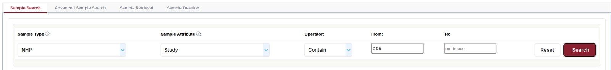
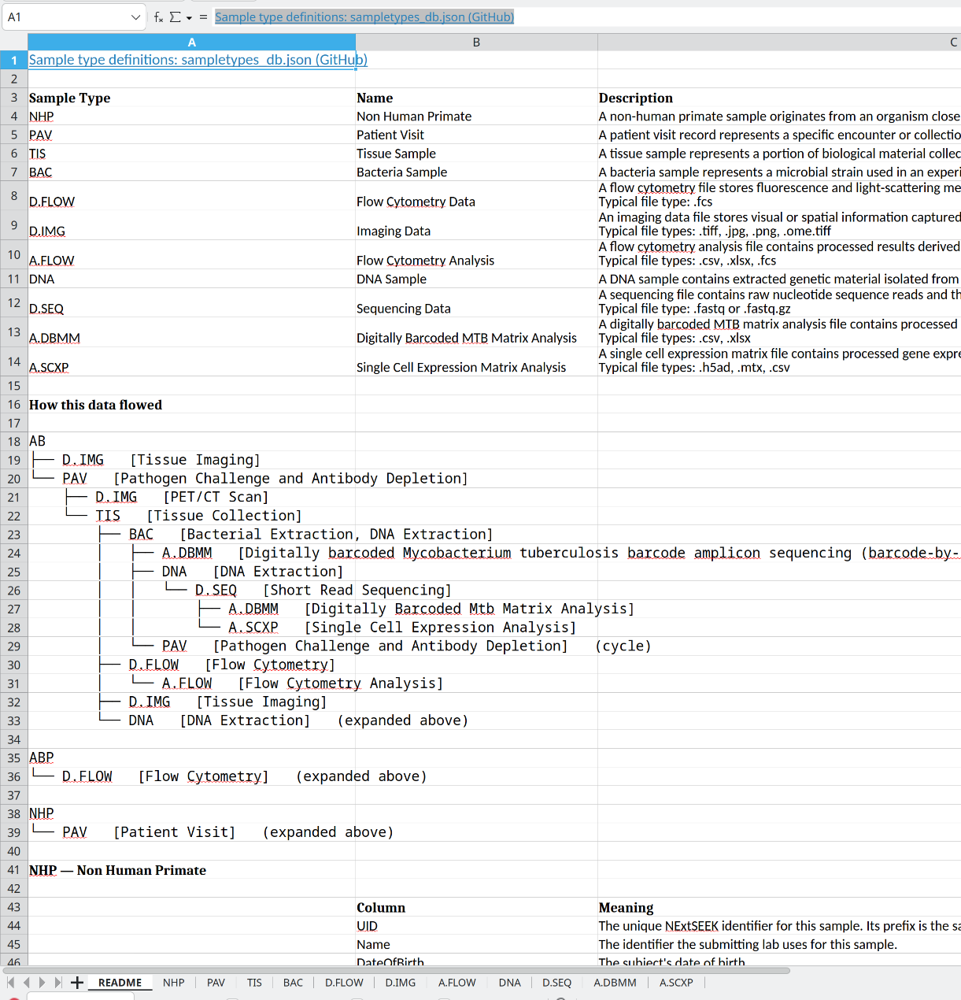

# Searching and downloading

Sample Search finds samples across the projects you belong to, and a download gives you the samples with their metadata in an Excel workbook. You need to sign in. Search runs on the sample graph, see [Graph search](graph-search.md).

## Find a sample by UID

The **Search by UID** box sits at the top of the sidebar on every page. Type a UID and press Enter to open that sample's page. It opens only if the UID is valid and you have access. Pages for samples with many relatives take longer to load.

## Sample Search

Open **Sample Search** in the sidebar. The page has four tabs on a laptop or desktop.

| Tab | Use it to |
|---|---|
| Sample Search | Search one sample type by one attribute |
| Advanced Sample Search | Combine terms with AND, OR and NOT across all types |
| Sample Retrieval | Paste UIDs and download them with their lineage |
| Sample Deletion | Paste UIDs to delete |

<figure>
  
  <figcaption>Sample Search: pick a type, an attribute, an operator and a value.</figcaption>
</figure>

### Search one attribute

1. Choose a **Sample Type**.
2. Choose a **Sample Attribute** of that type.
3. Choose an **Operator**, for example Contain.
4. Type the value in **From**. Operators that take a range also use **To**.
5. Click **Search**. **Reset** clears the form.

The info icons next to Sample Type and Sample Attribute open the [sample types](/seek/sampletypes/) and [attributes](/seek/samples/attributes/) pages.

**Associated with** (optional) keeps only samples that have a sample of another type in their lineage. Pick the type, then choose **Either**, **Ancestors only** or **Descendants only**. For example, find tissue samples that came from a given species, or sequencing files made from them.

### Advanced search

1. Type a **Search Value**.
2. Choose the **Logic**: Add with AND, OR or NOT.
3. Optionally choose a **Sample Type**.
4. Click **Add**. The term joins the **Current query box**.
5. Repeat for more terms.
6. Choose **Partial** or **Exact** matching, and optionally **Associated with**.
7. Click **Search**.

The query box also reads parentheses, so `(a OR b) AND c` works.

### The results table

Results show 1000 at a time, with a pager. The count above the table is the total. Each row shows the UID, sample type, assays, contributor and the attribute and value that matched.

* Click a UID to open the sample page.
* Type in the boxes under the headers to filter the rows that are loaded. The filters do not search the rest of the results.
* Tick rows to select them, then use the toolbar.

On a phone you get a smaller form: type a keyword, choose a type and tap Search. It shows up to 100 results and has no download.

## Download samples

Search, tick the samples you want, and click **Download samples** in the toolbar. You get an Excel workbook.

On Sample Search a prompt asks **Include all associated samples?**

| Answer | You get |
|---|---|
| No | Only the samples you ticked |
| Yes | The ticked samples plus their parents and children |

Advanced Sample Search and Sample Retrieval always include the associated samples. A large download takes a while, so wait for the progress box to finish.

<figure>
  
  <figcaption>A downloaded workbook. The first sheet defines the sample types and draws how the data flowed. Each sample type then has its own sheet.</figcaption>
</figure>

### Sample Retrieval

Use this when you already have UIDs, for example from a paper or a collaborator.

1. Open the **Sample Retrieval** tab.
2. Paste the UIDs, one per line.
3. Click **Retrieve Samples**.

You get the same workbook, with every associated sample.

## Protocols and data files

**Data Query** in the sidebar has two pages:

* **Data File Query**
* **Protocol Query**

Each is a table of the files you can see. Filter it with the boxes under the headers. Open a file from its link in the table.

## Delete samples

Use **Delete samples** in the toolbar, or the **Sample Deletion** tab, where you paste UIDs. You must own the samples or be an administrator. Type `DELETE` to confirm. Deletion cannot be undone.

A sample cannot be deleted while other samples still have it as a parent. Delete the children first. Each sample takes a few seconds.

To remove a protocol or data file, open it in SEEK and use its Actions menu.

## Check your counts

Sample Search shows only samples in projects you belong to. If a count looks low, check your project membership, then see [Graph search](graph-search.md). For the registration side, see [Uploading](uploading.md), and for how samples link to each other, see [Data model](data-model.md).
